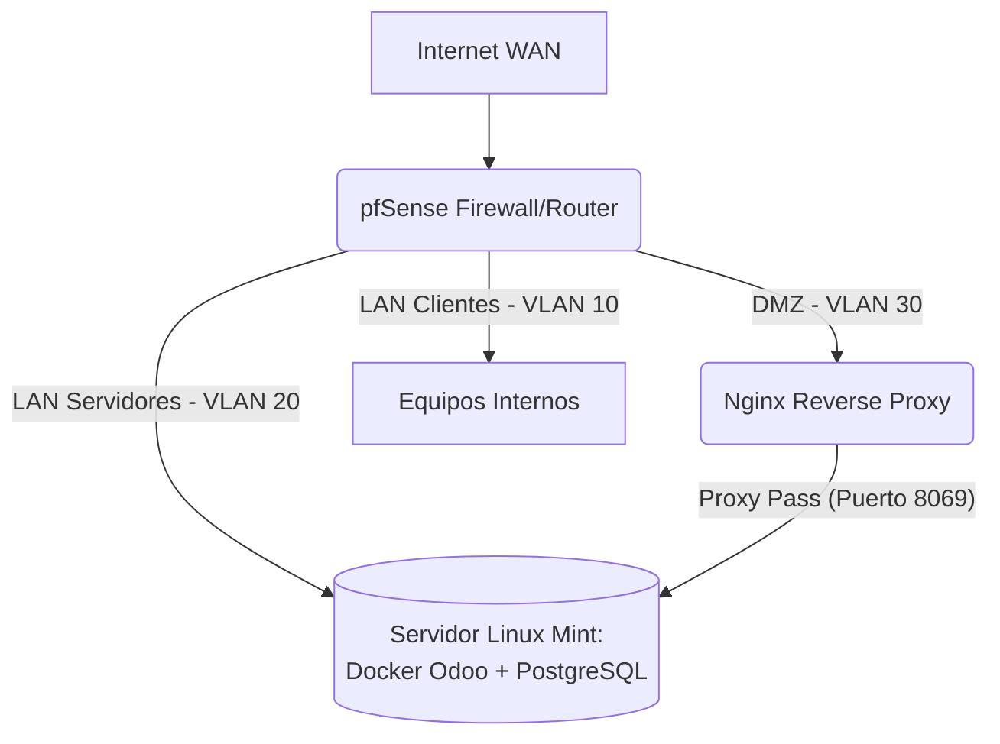

# Implantación Segura y Automatizada de Odoo con pfSense y Docker

**Autor:** Sandra Fradejas Avedillo (y equipo)
**Grado:** ASIR - Administración de Sistemas Informáticos en Red
**Fecha:** Febrero/Marzo 2026

---

## 📋 Resumen Ejecutivo

Este repositorio documenta el diseño e implantación de un entorno productivo completo para el ERP/CRM **Odoo**, simulando las necesidades de una empresa ("TechSolutions S.L."). La arquitectura se caracteriza por su enfoque en la seguridad, la contenerización y las buenas prácticas de administración de sistemas.

**Características principales:**
*   **Seguridad Perimetral (Firewall 3 capas):** Enrutamiento y políticas restrictivas mediante pfSense (WAN/LAN/DMZ).
*   **Orquestación de Contenedores:** Despliegue de servicios (Odoo 17 y PostgreSQL 16) usando Docker y Docker Compose sobre GNU/Linux Mint.
*   **Segmentación de Red:** Soporte de VLANs (10, 20, 30) para aislar el tráfico de clientes, servidores y servicios públicos.
*   **Acceso Seguro (Proxy Inverso):** Publicación del servicio mediante Nginx en la DMZ, con terminación SSL, limitando el acceso a los puertos 80/443.
*   **Automatización y Auditoría:** Scripts en Bash para *backups* y despliegue, junto con *Triggers* (PL/pgSQL) para la monitorización de acciones en la base de datos.

---

## 🏗️ Arquitectura de Red

La topología divide la red en tres zonas de confianza principales:

*   **WAN (Internet):** Acceso externo simulado.
*   **DMZ (VLAN 30 - 192.168.30.0/24):** Zona desmilitarizada alojando el Proxy Nginx.
*   **LAN:**
    *   **Clientes (VLAN 10 - 192.168.10.0/24):** Equipos internos de la empresa.
    *   **Servidores (VLAN 20 - 192.168.20.0/24):** Aplicativo Odoo y PostgreSQL.

### Reglas Principales de Firewall (pfSense/UFW)

*   **WAN a DMZ:** Permitir tráfico entrante a los puertos 80 (HTTP) y 443 (HTTPS) hacia el Proxy Nginx.
*   **DMZ a LAN (Servidores):** Permitir tráfico única y exclusivamente hacia el puerto 8069 (Odoo).
*   **LAN (Clientes) a LAN (Servidores):** Permitido el acceso directo o redirigido al puerto 8069.
*   **Bloqueos Explícitos:** Desde la DMZ hacia el puerto de administración de pfSense y hacia la LAN de clientes.

---

## 🚀 Fases de Implantación

A continuación, se detalla la hoja de ruta seguida para la ejecución del proyecto:

### 1. Preparación de la Infraestructura
*   Configuración del hipervisor (VMware/VirtualBox).
*   Despliegue de pfSense con sus respectivas interfaces virtuales (Trunk/VLANs).
*   Instalación del S.O. anfitrión (Linux Mint 22) con direccionamiento IP estático.

### 2. Contenerización (Docker / Odoo)
*   Instalación de `docker`, `docker-compose` y securización del daemon.
*   Creación del fichero `docker-compose.yml` declarativo para instanciar Odoo 17 y PostgreSQL 16.
*   Configuración de volúmenes persistentes localizados en `./data`.

### 3. Automatización y Bases de Datos
*   Desarrollo de *scripts* Bash:
    *   `backup.sh`: Copias de seguridad automáticas (pg_dump).
    *   `restore.sh`: Recuperación ante desastres (pg_restore).
*   Programación de funciones PL/pgSQL y disparadores (`Triggers`) para auditar los accesos e inserciones en las tablas críticas del ERP.

### 4. Capa de Presentación Segura (Nginx en DMZ)
*   Instalación de Nginx como proxy inverso.
*   Configuración de cabeceras de proxy (`X-Forwarded-For`, `Host`).
*   Implementación de certificados SSL para forzar conexiones HTTPS desde el exterior.

---

## 🧰 Stack Tecnológico

*   **Redes/Seguridad:** pfSense (FreeBSD), UFW.
*   **Virtualización/Orquestación:** Docker, Docker Compose.
*   **Sistema Operativo Base:** GNU/Linux Mint 22, Windows 10 (Clientes).
*   **Servicios Web/DB:** Nginx, Odoo 17 CE, PostgreSQL 16.
*   **Scripting:** Bash, ANSI SQL & PL/pgSQL.

---

## 📚 Estructura de este Repositorio

*(Esta sección se completará a medida que se suban los archivos)*

*   `/docker/`: Ficheros `docker-compose.yml` y configuraciones específicas de los contenedores (`odoo.conf`).
*   `/scripts/`: Utilidades en Bash para respaldos (`backup.sh`, `restore.sh`), despliegue, etc.
*   `/sql/`: Sentencias y *Triggers* de PL/pgSQL para auditoría de base de datos.
*   `/config_nginx/`: Archivos de configuración de los *Server Blocks* del proxy inverso.
*   `/docs/`: Documentación adicional, capturas de pantalla y diagramas de red.
