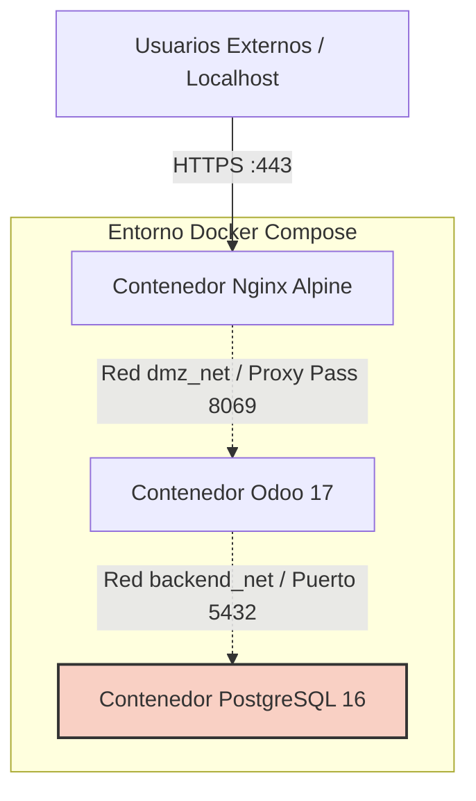

# Implantación Segura y Automatizada de Odoo (Arquitectura 100% Docker)

**Autor:** Mario Garcia, Javier Cordoba, Sandra Fradejas Avedillo 
**Grado:** ASIR - Administración de Sistemas Informáticos en Red
**Fecha:** Curso 2026

---

## 📋 Resumen Ejecutivo

Este repositorio documenta el diseño e implantación de un entorno productivo para el ERP/CRM **Odoo**. A diferencia de arquitecturas tradicionales, este proyecto prescinde totalmente de Máquinas Virtuales y plataformas hipervisoras, apostando por un despliegue **100% basado en contenedores Docker y redes lógicas**.

**Características principales:**
*   **Segmentación Lógica (Docker Networks):** Creación de redes tipo `bridge` internas (`dmz_net` y `backend_net`) para separar estrictamente la capa de presentación de la capa de datos.
*   **Orquestación de Contenedores:** Despliegue simultáneo de Nginx, Odoo 17 y PostgreSQL 16 mediante un único `docker-compose.yml`.
*   **Acceso Seguro (Proxy Inverso):** Recepción de peticiones externas mediante Nginx Alpine, terminación SSL y enrutamiento interno al aplicativo.
*   **Automatización y Auditoría:** Utilidades de scripting en Bash ejecutadas sobre los contenedores, y disparadores nativos (Triggers PL/pgSQL) de PostgreSQL.

---

## 🏗️ Arquitectura de Red (Docker Bridge)

El entorno se subdivide en dos recintos de red virtuales dentro del propio motor de Docker:

*   **WAN / Localhost:** El acceso desde el exterior (Navegador del usuario anfitrión).
*   **dmz_net (Red Externa):** Red bridge donde conviven Nginx y Odoo para interaccionar.
*   **backend_net (Red Interna Cerrada):** Red bridge aislada. PostgreSQL no mapea puertos al exterior y solo acepta peticiones de Odoo.

### Reglas y Políticas de Aislamiento
*   **Host a Nginx:** Están mapeados los puertos `80` y `443` del contenedor Nginx al host local.
*   **Odoo:** No expone puertos al exterior `(ports: [])`. Nginx lo alcanza resolviendo su nombre DNS interno (`http://odoo:8069`) sobre la red `dmz_net`.
*   **PostgreSQL:** Completamente aislado por la red `backend_net` marcada como `internal: true`.

---

## 🚀 Despliegue en 4 Fases

La hoja de ruta para inicializar el proyecto desde cero:

### 1. Estructura y Dependencias
*   Instalación de Docker y Docker Compose en el Host.
*   Creación de jerarquía de ficheros y volúmenes (`/data`, `/config_nginx`, `/certs`, `/scripts`).

### 2. Capa SSL y Proxy
*   Generación de pares `.key` y `.crt` locales mediante OpenSSL.
*   Definición de bloques Server de Nginx (`odoo_proxy.conf`) para enrutamiento interno a contenedores.

### 3. Orquestación y Bases de Datos
*   Ejecución centralizada mediante `docker-compose up -d`.
*   Montaje de volúmenes persistentes para salvaguardar la Base de Datos y los Addons/Filestore de Odoo.
*   Inyección del fichero `sql/audit_triggers.sql` en el volumen de arranque SQL para configurar el registro de accesos.

### 4. Automatización y Testing
*   Desarrollo y asociación de scripts `backup.sh` y `restore.sh`.

---

## 🧰 Stack Tecnológico

*   **Virtualización de Aplicación:** Docker Engine, Docker Compose V3.
*   **Proxy y Web Server:** Nginx (Imagen Alpine).
*   **Middleware ERP:** Odoo 17 CE.
*   **Base de Datos Relacional:** PostgreSQL 16.
*   **Seguridad / Cifrado:** OpenSSL, HTTPS Header Hardening.
*   **Automatización:** Bash Scripting, GNU/Linux utils (`cron`), PL/pgSQL.

---

## 📚 Estructura de este Repositorio

*   `/docker/`: Fichero unificado `docker-compose.yml` que orquesta los 3 nodos.
*   `/scripts/`: Utilidades en Bash para respaldos (`backup.sh`, `restore.sh`), despliegue, etc.
*   `/sql/`: Sentencias y *Triggers* de PL/pgSQL para auditoría de base de datos.
*   `/config_nginx/`: Archivos de configuración de los *Server Blocks* del proxy inverso.
*   `/docs/`: Documentación de soporte, memorias del proyecto y planes de implantación (`implementation_plan.md`).
*   `/ISOs/`: (Obsoleto en arquitectura 100% Docker) Mantenida compatibilidad de repo.
*   `/certs/`: Directorio destinado a alojar la clave privada y certificado TLS para el proxy.
