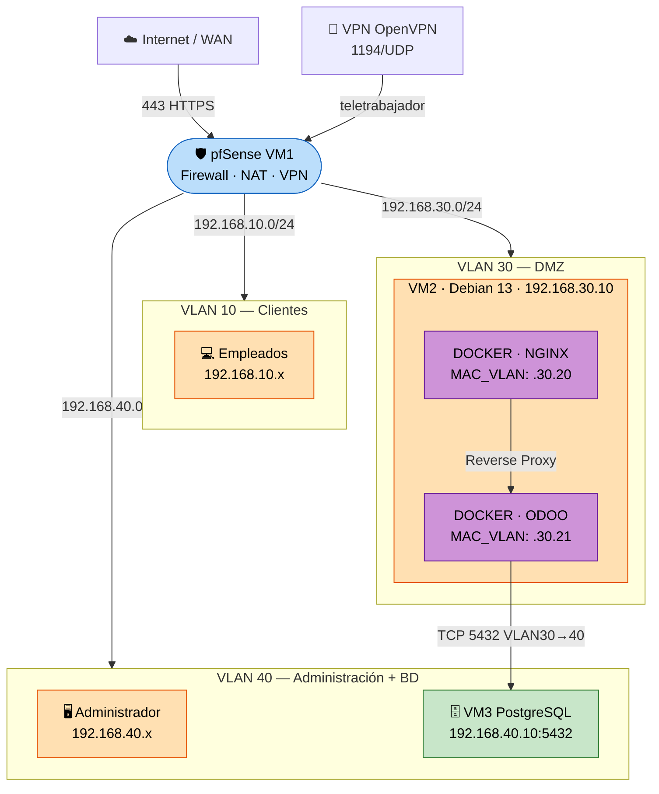

# Implantación Segura y Automatizada de Odoo con pfSense y Docker

**Autores:**

- Javier Córdoba Del Valle
- Mario García García
- Sandra Fradejas Avedillo

**Grado:** ASIR - Administración de Sistemas Informáticos en Red

**Centro:** IES Cañaveral — Departamento de Informática y Comunicaciones

**Fecha:** Curso 2025/2026

---

## 📋 Resumen Ejecutivo

Este repositorio documenta el diseño e implantación de un entorno productivo completo para el ERP/CRM **Odoo**, simulando las necesidades de una empresa ("TechSolutions S.L."). La arquitectura se caracteriza por su enfoque en la seguridad, la contenerización y las buenas prácticas de administración de sistemas.

> **⚠️ Estado actual (Mayo 2026):** La arquitectura ha evolucionado a **3 Máquinas Virtuales** orquestadas con Vagrant. PostgreSQL ya **no corre en Docker** sino en una VM dedicada en VLAN 40. LDAP ha sido **retirado del despliegue activo** y movido a `extras/ldap/` como mejora futura.

**Características principales:**

- **Infraestructura como Código (IaC):** 3 VMs definidas y aprovisionadas automáticamente con **Vagrant** (`Vagrantfile` en la raíz).
- **Seguridad Perimetral (Firewall 3 capas):** Enrutamiento y políticas restrictivas mediante pfSense (WAN/VLAN10/VLAN30/VLAN40) con reglas explícitas de bloqueo anti-pivoting.
- **Orquestación de Contenedores:** Despliegue de servicios (Nginx y Odoo 17) usando Docker y Docker Compose sobre **Debian 13 Server (Trixie)** — solo 2 contenedores activos.
- **Base de Datos Separada:** PostgreSQL 16 instalado nativamente en una **VM dedicada** (VLAN 40, `192.168.40.10`), aislada de los contenedores.
- **Segmentación de Red:** VLANs 10, 30 y 40 para aislar tráfico de usuarios, servicios y base de datos.
- **Redes MACVLAN:** Los contenedores Nginx y Odoo-web tienen IPs propias en VLAN 30 (`192.168.30.20` y `192.168.30.21`), visibles directamente por pfSense como hosts independientes.
- **Acceso Seguro (Proxy Inverso):** Publicación del servicio mediante Nginx Alpine con terminación SSL/TLS.
- **Backups Automatizados:** `pg_dump` remoto hacia la VM PostgreSQL cada 4 horas, con retención de 7 días y credenciales en `/etc/backup_odoo.env` (modo 600).
- **Gestión Visual:** Administración del servidor mediante **Cockpit** (interfaz web en puerto 9090).

---

## 🏗️ Arquitectura de Red — 3 VMs

> La topología divide la infraestructura en 3 VMs y 3 VLANs gestionadas por pfSense:

```
                    ┌─────────────────────────────────────────────────┐
                    │            pfSense (VM 1)                       │
                    │  WAN ─ VLAN10 (10.x) ─ VLAN30 (30.x) ─ VLAN40 │
                    └────────┬──────────────────┬──────────────┬──────┘
                             │                  │              │
                    VLAN 10  │         VLAN 30  │    VLAN 40   │
               192.168.10.0/24        192.168.30.0/24  192.168.40.0/24
                             │                  │              │
              ┌──────────────┘     ┌────────────┘   ┌──────────┘
              │                    │                 │
     ┌────────▼───────┐   ┌────────▼────────┐  ┌────▼────────────────┐
     │  Empleados /   │   │   VM 2 — Debian │  │  VM 3 — PostgreSQL  │
     │  Usuarios      │   │   192.168.30.10 │  │  192.168.40.10      │
     │  VLAN 10       │   │                 │  │                     │
     └────────────────┘   │  ┌─────────────┐│  │  PostgreSQL 16      │
                           │  │nginx-proxy  ││  │  (nativo, no Docker)│
                           │  │.30.20 MVLAN ││  │                     │
                           │  └──────┬──────┘│  │  pg_hba: solo       │
                           │         │       │  │  192.168.30.0/24    │
                           │  ┌──────▼──────┐│  └─────────────────────┘
                           │  │ odoo-web    ││
                           │  │.30.21 MVLAN ││
                           │  └──────┬──────┘│
                           │         │ 5432   │
                           │    BD externa   │
                           └─────────────────┘
```

### Tabla de Direccionamiento IP

| VM / Servicio | VLAN | IP | Puertos abiertos | Descripción |
|:---|:---|:---|:---|:---|
| pfSense (VM 1) | WAN / todas | dinámica WAN | 443 (WAN NAT), 1194/UDP (VPN) | Firewall + NAT + VPN |
| Servidor Debian (VM 2) | VLAN 30 | `192.168.30.10` | 22, 9090 | Host Docker + Cockpit |
| nginx-proxy | VLAN 30 (MACVLAN) | `192.168.30.20` | 80, 443 | Proxy inverso SSL |
| odoo-web | VLAN 30 (MACVLAN) | `192.168.30.21` | 8069, 8072 | Odoo 17 CE |
| PostgreSQL (VM 3) | VLAN 40 | `192.168.40.10` | 5432 (solo VLAN 30) | BD externa nativa |
| Administrador | VLAN 40 | `192.168.40.x` | — | Acceso SSH, Cockpit, psql |
| Empleados/Clientes | VLAN 10 | `192.168.10.x` | — | Solo HTTPS a Nginx |

### Diagrama de flujos de red (Mermaid)



### Reglas principales de Firewall (pfSense)

| Origen | Destino | Puertos | Acción | Propósito |
|:---|:---|:---|:---|:---|
| WAN | `192.168.30.20` (Nginx) | 443 | ✅ NAT + Pass | Acceso externo HTTPS |
| VLAN 10 | `192.168.30.20` (Nginx) | 443 | ✅ Pass | Empleados a Odoo |
| VLAN 30 (Odoo) | `192.168.40.10` (PostgreSQL) | 5432 | ✅ Pass | Odoo → BD externa |
| VLAN 40 (Admin) | `192.168.30.10` | 22, 9090 | ✅ Pass | SSH + Cockpit |
| VLAN 40 (Admin) | `192.168.40.10` | 5432 | ✅ Pass | Acceso DBA directo |
| WAN | `192.168.40.10` | 5432 | ❌ Block | BD nunca expuesta a Internet |
| VLAN 10 | `192.168.40.10` | 5432 | ❌ Block | Usuarios no tocan la BD |
| VLAN 10 | `192.168.30.21` | 8069 | ❌ Block | No acceso directo a Odoo |
| DMZ | VLAN 10 | * | ❌ Block | Anti-pivoting |

---

## 🚀 Inicio Rápido — Vagrant

> **Instalación completa desde cero:** [`docs/INSTALACION_COMPLETA.md`](docs/INSTALACION_COMPLETA.md)

```bash
# 1. Clonar el repositorio
git clone https://github.com/sandrafrv/TFG-Implantacion_Segura_y_Automatizada_de_Odoo.git
cd TFG-Implantacion_Segura_y_Automatizada_de_Odoo

# 2. Copiar y completar el archivo de variables de entorno (en la RAÍZ)
cp .env.example .env
nano .env

# 3. Levantar las 3 VMs automáticamente
vagrant up

# 4. Verificar estado
vagrant status

# VMs disponibles:
# - pfsense   (VM 1 — VLAN 10/30/40)   → configurar manualmente o via config.xml
# - odoo-server (VM 2 — VLAN 30)       → Debian + Docker + Nginx + Odoo
# - db-server   (VM 3 — VLAN 40)       → Debian + PostgreSQL 16 nativo

# 5. Acceder a Odoo
# https://192.168.30.20  (desde VLAN 10 o navegador del host)
```

### Comandos útiles post-despliegue

```bash
# Estado de los contenedores (en VM 2)
vagrant ssh odoo-server
docker compose -f /opt/erp-odoo/docker/docker-compose.yml ps

# Logs de Odoo
docker compose -f /opt/erp-odoo/docker/docker-compose.yml logs odoo-web --tail=50

# Estado de PostgreSQL (en VM 3)
vagrant ssh db-server
systemctl status postgresql

# Backup manual
bash scripts/mantenimiento/backup_postgres.sh

# Menú de administración interactivo
bash scripts/deploy/erp.sh
```

---

## 🐳 Docker — Contenedores activos

> ⚠️ A partir de Mayo 2026, el `docker-compose.yml` **solo contiene 2 servicios**:

| Contenedor | Imagen | IP (MACVLAN VLAN 30) | Propósito |
|:---|:---|:---|:---|
| `nginx-proxy` | `nginx:alpine` | `192.168.30.20` | Proxy inverso SSL/TLS |
| `odoo-web` | `odoo:17` | `192.168.30.21` | Aplicación Odoo 17 CE |

El servicio `db` (PostgreSQL) y el servicio `ldap` (OpenLDAP) han sido **eliminados del compose**.

- PostgreSQL → VM 3 nativa en `192.168.40.10` (ver `docker/odoo.conf`: `db_host = 192.168.40.10`)
- LDAP → retirado del despliegue, disponible como mejora futura en `extras/ldap/`

---

## 🔐 Variables de Entorno (`.env`)

> El archivo `.env` debe estar siempre en la **raíz** del repositorio (no en `docker/`).

```bash
# Copia la plantilla
cp .env.example .env
```

Variables requeridas (sin referencias a LDAP en esta versión):

```env
# Base de datos externa (VM 3)
POSTGRES_DB=odooerp
POSTGRES_USER=odoo
POSTGRES_PASSWORD=<contraseña_segura>
POSTGRES_HOST=192.168.40.10
POSTGRES_PORT=5432

# Odoo
ODOO_ADMIN_PASSWD=<master_password_odoo>

# SSL (rutas en la VM 2)
SSL_CERT_PATH=/etc/ssl/certs/odoo-selfsigned.crt
SSL_KEY_PATH=/etc/ssl/private/odoo-selfsigned.key
```

---

## 🗄️ Backups y Recuperación

Los backups se ejecutan automáticamente vía cron cada **4 horas** desde la VM 2.

```bash
# Credenciales de BD almacenadas de forma segura (solo root lee)
# /etc/backup_odoo.env  →  chmod 600

# Script de backup (usa pg_dump remoto)
bash scripts/mantenimiento/backup_postgres.sh

# Script de restauración
bash scripts/mantenimiento/restore.sh <archivo_backup.sql.gz>

# Backups almacenados en:
# /opt/erp-odoo/backups/postgres/
# Retención: últimos 7 días
```

---

## 📚 Estructura del Repositorio

```
TFG-Implantacion_Segura_y_Automatizada_de_Odoo/
├── Vagrantfile                  # Define y orquesta las 3 VMs
├── .env.example                 # Plantilla de variables de entorno (sin LDAP)
├── .env                         # Variables reales (excluido de Git)
├── README.md                    # Este archivo
├── CLAUDE.md                    # Instrucciones para el asistente IA
├── REALIZADO_PDF_PASOS.md       # Checklist de progreso del TFG
│
├── vagrant/                     # Scripts de aprovisionamiento de las 3 VMs
│   ├── provision_debian.sh      # Aprovisiona VM2 (Odoo+Nginx+Docker)
│   ├── provision_pfsense.sh     # Aprovisiona VM1 (pfSense)
│   ├── provision_postgres.sh    # Aprovisiona VM3 (PostgreSQL nativo)
│   └── Explicacion_provision_postgres.md
│
├── docker/                      # Configuración de contenedores (solo Odoo+Nginx)
│   ├── docker-compose.yml       # Solo: odoo-web + nginx-proxy
│   └── odoo.conf                # db_host = 192.168.40.10
│
├── config_nginx/                # Configuración Nginx proxy inverso + SSL
│   └── odoo_proxy.conf
│
├── scripts/                     # Scripts Bash de automatización
│   ├── README.md                # Índice de todos los scripts
│   ├── deploy/                  # Despliegue: deploy.sh, erp.sh, configure.sh...
│   ├── mantenimiento/           # backup_postgres.sh, restore.sh, monitor.sh...
│   ├── odoo/                    # odoo_crear_usuarios.sh, odoo_setup_wizard.sh
│   └── ldap/                    # ⚠️ DEPRECADO — scripts LDAP sin uso activo
│
├── sql/                         # Triggers PL/pgSQL de auditoría
│   └── audit_triggers.sql
│
├── config/
│   └── logrotate.d/erp-odoo     # Rotación de logs (incluye backup_odoo.log)
│
├── extras/
│   └── ldap/                    # LDAP como mejora futura
│       ├── README.md            # Por qué se retiró y cómo retomarlo
│       └── estructura.ldif      # Backup estructura usuarios/grupos
│
├── ldap/                        # ⚠️ LEGACY — material histórico de LDAP
│
└── docs/                        # Documentación técnica completa
    ├── README.md
    ├── CHANGELOG.md
    ├── CONTROL_ACCESO.md
    ├── HISTORIAL_IMPLEMENTACION.md
    ├── INSTALACION_COMPLETA.md
    ├── diagrama_red.md
    ├── reglas_pfsense.md
    ├── memoria_tfg_borrador.md
    ├── memoria_tfg_nuevo.md
    ├── guias/                   # Guías por módulo
    ├── mas_info/                # Informe ERP e investigación
    └── archive/                 # Documentos históricos (no modificar)
```

---

## 🧰 Stack Tecnológico

| Capa | Tecnología |
|:---|:---|
| IaC / Orquestación VMs | **Vagrant** + VirtualBox/VMware |
| Redes / Seguridad | pfSense (FreeBSD), UFW |
| Contenerización | Docker Engine, Docker Compose |
| Sistema Operativo Base | **Debian 13 Server (Trixie)** + Cockpit |
| Proxy Inverso | Nginx (Alpine Linux) — Docker con MACVLAN |
| ERP / CRM | Odoo 17 CE — Docker con MACVLAN |
| Base de Datos | PostgreSQL 16 — **VM nativa** (no Docker) |
| Certificados | OpenSSL (autofirmados TLS) |
| Scripting | GNU Bash, PL/pgSQL |
| Control de Versiones | Git + GitHub |
| CI/CD | GitHub Actions (ShellCheck + deploy) |

---

## ⚙️ CI/CD — GitHub Actions

| Workflow | Trigger | Qué hace |
|:---|:---|:---|
| `ci.yml` | `push` / `PR` a `main` | ShellCheck de todos los `.sh` (incluye `vagrant/`), YAML lint, generación y validación de `config.xml` pfSense |
| `deploy.yml` | `push` a `main` | Pull del repo en servidor, `docker compose up`, verifica que `odoo-web` y `nginx-proxy` estén `healthy` |

> La verificación post-despliegue ya **no incluye** contenedores de PostgreSQL ni LDAP.

---

## 👥 Reparto de Roles

| Integrante | Especialización |
|:---|:---|
| **Sandra Fradejas Avedillo** | Sistemas y Orquestación |
| **Mario García García** | Redes y Seguridad Perimetral |
| **Javier Córdoba Del Valle** | Bases de Datos y Automatización |

---

## ❓ ¿Por qué Odoo y no otra alternativa?

| Criterio | **Odoo 17** | Dolibarr | ERPNext |
|:---|:---|:---|:---|
| **Facilidad de uso** | ✅ Alta — interfaz moderna e intuitiva | Media — sencillo pero básico | Media — muy completo pero abrumador |
| **Flexibilidad de API** | ✅ Muy alta — XML-RPC y JSON-RPC | Limitada | Alta (API REST) pero compleja |
| **Consumo de recursos** | Moderado | ✅ Muy ligero | Pesado |
| **Cobertura funcional** | ✅ CRM, Ventas, RRHH, Inventario, Proyectos | Básico | Muy completo |
| **Comunidad y soporte** | ✅ Muy activa, documentación extensa | Activa (menor escala) | Activa |
| **Idoneidad para el TFG** | ✅ **Elegido** | Descartado | Descartado |

---

## 🎓 Módulos Académicos Cubiertos (ASIR)

| Módulo | Contenido aplicado |
|:---|:---|
| **Seguridad y Alta Disponibilidad** | pfSense DMZ, UFW, reglas firewall inter-VLAN, backups automáticos cada 4h |
| **Gestión de Bases de Datos** | PostgreSQL nativo en VM dedicada, triggers PL/pgSQL, auditoría `asir_audit_log`, pg_dump remoto |
| **Servicios de Red** | DHCP pfSense, NAT, DNS, cabeceras HTTP seguras, VPN OpenVPN |
| **Redes** | VLANs 10/30/40, topología 3 segmentos, inter-VLAN controlado |
| **Arquitectura de la Nube** | Docker, MACVLAN, proxy inverso Nginx SSL/TLS |
| **Administración de Sistemas** | Vagrant IaC, scripts Bash, despliegue automatizado, monitorización |

---

## 🔮 Mejoras Futuras

| Mejora | Descripción |
|:---|:---|
| **LDAP / Active Directory** | Ver `extras/ldap/README.md` — estructura lista, solo falta integración con el compose |
| **Ansible (IaC)** | Sustituir scripts de aprovisionamiento Vagrant por un Playbook Ansible |
| **Alta Disponibilidad PostgreSQL** | Patroni + replicación entre 2 nodos para evitar SPOF en la BD |
| **Stack de Monitorización** | Prometheus + Grafana o Uptime Kuma con panel gráfico en tiempo real |
| **VPN WireGuard** | Migrar de OpenVPN a WireGuard para mayor rendimiento |
