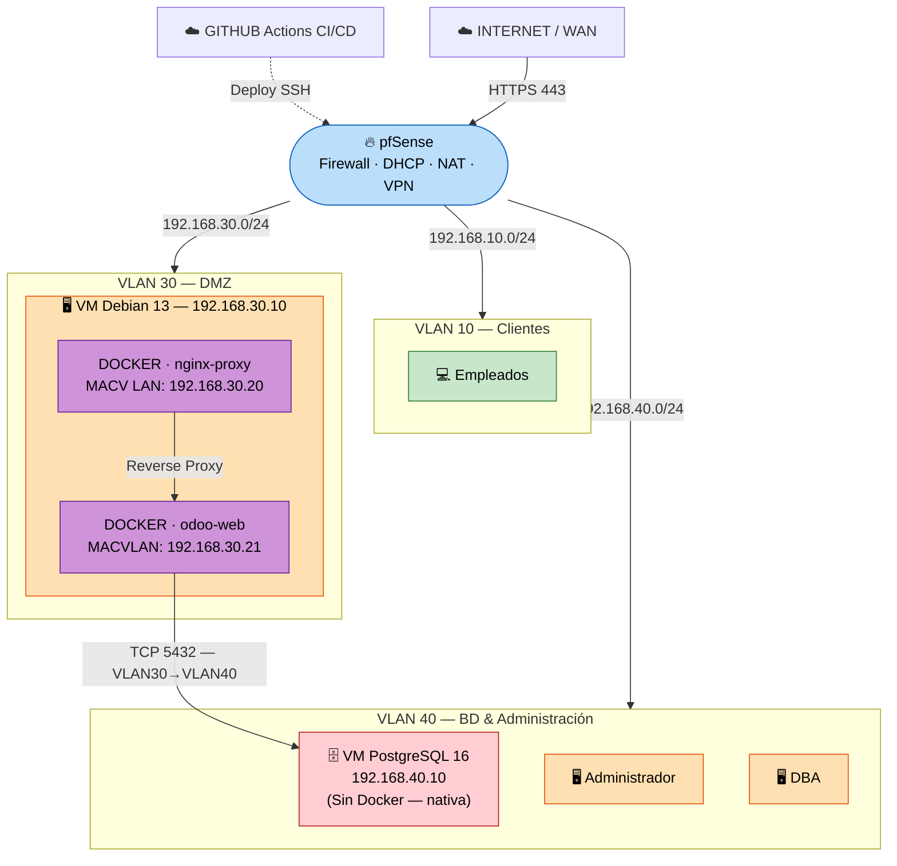

# Implantación Segura y Automatizada de Odoo con pfSense y Docker

**Autores:**

- Javier Córdoba Del Valle
- Mario García García
- Sandra Fradejas Avedillo

**Grado:** ASIR - Administración de Sistemas Informáticos en Red

**Centro:** IES Cañaveral — Departamento de Informática y Comunicaciones

**Fecha:** Curso 2025/2026

---

## 📋 Resumen Ejecutivo

Este repositorio documenta el diseño e implantación de un entorno productivo completo para el ERP/CRM **Odoo**, simulando las necesidades de una empresa ("TechSolutions S.L."). La arquitectura se caracteriza por su enfoque en la seguridad, la contenerización y las buenas prácticas de administración de sistemas.

**Características principales:**

- **Seguridad Perimetral (Firewall 3 capas):** Enrutamiento y políticas restrictivas mediante pfSense (WAN/LAN/DMZ/BD) con reglas explícitas de bloqueo anti-pivoting.
- **Infraestructura como Código:** Orquestación de las 3 máquinas virtuales con **Vagrant + VirtualBox**, automatizando el aprovisionamiento completo del entorno.
- **Orquestación de Contenedores:** Despliegue de servicios (Nginx y Odoo 17) usando Docker y Docker Compose sobre **Debian 13 Server (Trixie)**. Solo corren `odoo-web` y `nginx-proxy` — PostgreSQL reside en una **VM externa dedicada**.
- **Base de Datos Aislada:** PostgreSQL 16 en **VM independiente** (VLAN 40 — `192.168.40.10`), completamente separada de la DMZ para máximo aislamiento de la capa de datos.
- **Segmentación de Red:** VLANs (10, 30, 40) para aislar tráfico de clientes, servicios públicos y base de datos.
- **Redes MACVLAN:** Los contenedores Nginx y Odoo-web tienen IPs propias en la VLAN 30 (`192.168.30.20` y `192.168.30.21`), visibles directamente por pfSense como hosts independientes.
- **Acceso Seguro (Proxy Inverso):** Publicación del servicio mediante Nginx Alpine con terminación SSL/TLS, limitando el acceso a los puertos 80/443.
- **Automatización y Auditoría:** Scripts Bash para backups remotos (`pg_dump`), restauración, monitorización y despliegue, junto con Triggers PL/pgSQL para auditoría en la BD.
- **Gestión Visual:** Administración del servidor mediante **Cockpit** (interfaz web en puerto 9090).
- **LDAP:** Descartado del despliegue principal por complejidad y reducción de superficie de ataque. Material disponible en `extras/ldap/` como referencia futura.

---

## 🏗️ Arquitectura de Red

La topología divide la red en **cuatro zonas de confianza** gestionadas por un firewall pfSense:

- **WAN (Internet):** Acceso externo simulado.
- **LAN Clientes (VLAN 10 — 192.168.10.0/24):** Equipos internos de la empresa.
- **DMZ (VLAN 30 — 192.168.30.0/24):** Servidor Debian con Docker (Nginx + Odoo). Gestionado desde Cockpit (`https://192.168.30.10:9090`).
- **LAN Base de Datos (VLAN 40 — 192.168.40.0/24):** VM exclusiva de PostgreSQL + red de administración.



> ⚠️ **PostgreSQL NO corre como contenedor Docker.** Está en la **VM `db-server`** (`192.168.40.10`, VLAN 40), completamente separada de la DMZ. Esta separación garantiza que, incluso si el stack Docker se ve comprometido, la base de datos permanece inaccesible desde la DMZ.

---

### Tabla de Direccionamiento IP

| Zona | Subred (CIDR) | Gateway (pfSense) | IP del Sistema | Puertos Abiertos | Servicio |
| :--- | :--- | :--- | :--- | :--- | :--- |
| WAN (Exterior) | Red Fija/DHCP | Router físico | IP WAN | 80, 443 (NAT) | Redirección NAT hacia DMZ |
| DMZ (VLAN 30) | `192.168.30.0/24` | `192.168.30.1` | **`192.168.30.10`** | 22, 9090 | Servidor Debian — SSH y Cockpit |
| DMZ — nginx-proxy | `192.168.30.0/24` | `192.168.30.1` | **`192.168.30.20`** | 80, 443 | Proxy inverso Nginx (MACVLAN) |
| DMZ — odoo-web | `192.168.30.0/24` | `192.168.30.1` | **`192.168.30.21`** | 8069, 8072 | Aplicación Odoo 17 (MACVLAN) |
| BD (VLAN 40) | `192.168.40.0/24` | `192.168.40.1` | **`192.168.40.10`** | 5432 | PostgreSQL 16 — VM nativa |
| LAN Clientes (VLAN 10) | `192.168.10.0/24` | `192.168.10.1` | `192.168.10.x` | — | Equipos de usuarios |

### Reglas Principales de Firewall (pfSense)

| Origen | Destino | Puertos | Acción | Propósito |
| :--- | :--- | :--- | :--- | :--- |
| WAN | DMZ (`192.168.30.20`) | 80, 443 | ✅ Permitir | Acceso web al ERP vía NAT → nginx MACVLAN |
| LAN (VLAN 10) | DMZ (`192.168.30.20`) | 443, 80 | ✅ Permitir | Clientes internos a Odoo |
| Admin (VLAN 40) | DMZ (`192.168.30.10`) | 22, 9090 | ✅ Permitir | SSH y Cockpit (solo admin) |
| DMZ (VLAN 30) | BD (`192.168.40.10`) | 5432 | ✅ Permitir | Odoo → PostgreSQL externo |
| LAN (VLAN 10) | BD (`192.168.40.10`) | 5432 | ❌ Bloquear | Usuarios no acceden directamente a la BD |
| WAN | BD (`192.168.40.10`) | 5432 | ❌ Bloquear | BD no expuesta a Internet |
| DMZ | LAN (VLAN 10) | * | ❌ Bloquear | Anti-pivoting |
| DMZ | pfSense (gestión) | 443, 80, 22 | ❌ Bloquear | Proteger panel del firewall |

---

## 🚀 Inicio Rápido con Vagrant

La forma más rápida de levantar el entorno completo:

```bash
git clone https://github.com/sandrafrv/TFG-Implantacion_Segura_y_Automatizada_de_Odoo.git
cd TFG-Implantacion_Segura_y_Automatizada_de_Odoo
cp .env.example .env
nano .env              # Rellenar variables obligatorias
vagrant up             # Levanta las 3 VMs automáticamente
```

> Para instalación manual paso a paso: [`docs/INSTALACION_COMPLETA.md`](docs/INSTALACION_COMPLETA.md)

### VMs que se crean

| VM Vagrant | Rol | IP | VLAN |
|---|---|---|---|
| `vm-pfsense` | Firewall / Router | 192.168.10.1 / 30.1 / 40.1 | WAN + 10 + 30 + 40 |
| `vm-odoo` | Debian + Docker (Nginx + Odoo) | 192.168.30.10 | VLAN 30 |
| `vm-postgres` | PostgreSQL 16 nativo | 192.168.40.10 | VLAN 40 |

---

## 🧰 Stack Tecnológico

| Capa | Tecnología |
| :--- | :--- |
| Infraestructura como Código | **Vagrant + VirtualBox** |
| Redes / Seguridad | pfSense (FreeBSD), UFW |
| Virtualización / Orquestación | Docker Engine, Docker Compose |
| Sistema Operativo Base | **Debian 13 Server (Trixie)** con Cockpit |
| Proxy Inverso | Nginx (Alpine Linux) — contenedor Docker con MACVLAN |
| ERP / CRM | Odoo 17 CE — contenedor Docker con MACVLAN |
| Base de Datos | PostgreSQL 16 — **VM externa** (VLAN 40, `192.168.40.10`) |
| Certificados | OpenSSL (autofirmados TLS) |
| Scripting | GNU Bash, ANSI SQL & PL/pgSQL |
| Control de Versiones | Git + GitHub |
| Integración Continua | GitHub Actions (`shellcheck`, `yamllint`, `docker compose config`) |

---

## 📚 Estructura de este Repositorio

| Directorio / Archivo | Descripción |
|:---------------------|:------------|
| `Vagrantfile` | Define y orquesta las 3 VMs con sus redes y recursos |
| `vagrant/` | Scripts de aprovisionamiento para cada VM |
| `docker/` | `docker-compose.yml` (solo `odoo-web` + `nginx-proxy`) y `odoo.conf` |
| `scripts/deploy/` | Scripts de despliegue, configuración y cron de backups |
| `scripts/mantenimiento/` | Backup remoto (`pg_dump`), restauración, monitorización y actualizaciones |
| `scripts/odoo/` | Creación de usuarios y setup wizard de Odoo |
| `scripts/ldap/` | ⚠️ Scripts LDAP — **desactivados**, solo referencia. Ver `extras/ldap/` |
| `sql/` | Triggers PL/pgSQL para auditoría de base de datos |
| `config_nginx/` | Configuración del proxy inverso Nginx con SSL y cabeceras de seguridad |
| `extras/ldap/` | Material LDAP descartado del despliegue — mejora futura |
| `ldap/` | Estructura base del directorio LDAP (legacy) |
| `docs/` | Documentación técnica completa |
| `docs/guias/` | Guías de instalación por módulo |
| `.env.example` | Plantilla de variables de entorno (sin variables LDAP) |
| `CLAUDE.md` | Instrucciones para agentes IA que trabajen en este repo |

---

## 🔒 Variables de Entorno

Copiar `.env.example` a `.env` en la raíz del proyecto (nunca dentro de `docker/`):

```env
ODOO_ADMIN_PASSWD=cambia_esto
DB_HOST=192.168.40.10
DB_PORT=5432
DB_USER=odoo
DB_PASSWORD=cambia_esto
DOMAIN=tu_dominio_o_ip
```

> Las variables de LDAP han sido eliminadas. Ver `extras/ldap/README.md` si se quiere retomar en el futuro.

---

## 🧩 Redes MACVLAN

Los contenedores activos tienen IPs propias en la VLAN 30:

```bash
docker network create \
  --driver macvlan \
  --subnet=192.168.30.0/24 \
  --gateway=192.168.30.1 \
  --opt parent=ens18 \
  macvlan_vlan30
```

| Contenedor | Red interna (`odoo_net`) | Red MACVLAN (`macvlan_vlan30`) |
| :--- | :--- | :--- |
| `odoo-web` (Odoo 17) | 172.19.0.3 | `192.168.30.21` |
| `nginx-proxy` (Nginx) | 172.19.0.4 | `192.168.30.20` |

> **Nota técnica:** Con el driver `macvlan`, el host Debian no puede comunicarse directamente con las IPs MACVLAN de sus propios contenedores. Para verificar conectividad desde el host: `docker run --rm --network macvlan_vlan30 alpine wget -qO- https://192.168.30.20`

---

## 🔄 CI/CD — GitHub Actions

| Workflow | Qué hace |
|---|---|
| `ci.yml` | `shellcheck` en `scripts/` y `vagrant/`; `yamllint`; `docker compose config -q` |
| `deploy.yml` | Pull, rebuild y verificación de `odoo-web` + `nginx-proxy` (sin PostgreSQL ni LDAP) |

---

## 👥 Reparto de Roles

| Integrante | Especialización |
| :--- | :--- |
| **Sandra Fradejas Avedillo** | Sistemas y Orquestación |
| **Mario García García** | Redes y Seguridad Perimetral |
| **Javier Córdoba Del Valle** | Bases de Datos y Automatización |

---

## 🔮 Mejoras Futuras

| Mejora | Descripción |
| :--- | :--- |
| **LDAP / Active Directory** | Centralizar credenciales usando LDAP o AD. Material en `extras/ldap/`. |
| **Ansible (IaC)** | Automatizar configuración del servidor Debian con Playbooks de Ansible. |
| **VPN WireGuard en pfSense** | Acceso al ERP solo mediante túnel VPN cifrado — Zero Trust. |
| **Stack de Monitorización** | Sustituir scripts de log por Prometheus + Grafana o Uptime Kuma. |
| **Alta Disponibilidad BD** | Patroni + replicación para PostgreSQL. |

---

## ❓ ¿Por qué Odoo?

| Criterio | **Odoo 17** | Dolibarr | ERPNext |
| :--- | :--- | :--- | :--- |
| **Facilidad de uso** | ✅ Alta | Media | Media |
| **Flexibilidad de API** | ✅ Muy alta | Limitada | Alta |
| **Consumo de recursos** | Moderado | ✅ Muy ligero | Pesado |
| **Cobertura funcional** | ✅ CRM, Ventas, RRHH, Inventario | Básico | Muy completo |
| **Comunidad y soporte** | ✅ Muy activa | Activa | Activa |
| **Idoneidad para el TFG** | ✅ **Elegido** | Descartado | Descartado |

---

## 🎓 Módulos Académicos Cubiertos (ASIR)

| Módulo | Contenido aplicado |
| :--- | :--- |
| **Seguridad y Alta Disponibilidad** | DMZ con pfSense, UFW, reglas de firewall, backups automatizados con retención |
| **Gestión de Bases de Datos** | Triggers PL/pgSQL con auditoría JSONB, `asir_audit_log`, PostgreSQL en VM externa |
| **Servicios de Red** | DHCP en pfSense, NAT, Port Forwarding, DNS interno, cabeceras HTTP |
| **Redes** | VLANs 10/30/40, monitorización de red, topología segmentada |
| **Arquitectura de la Nube** | Docker, proxy inverso Nginx con SSL/TLS, redes MACVLAN |
| **Administración de Sistemas** | Vagrant, scripts Bash, backups remotos, Cockpit |
