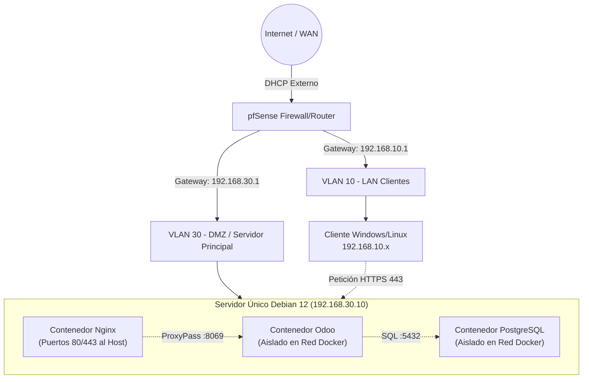

# Implantación Segura y Automatizada de Odoo con pfSense y Docker

**Autores:**

- Javier Córdoba Del Valle
- Mario García García
- Sandra Fradejas Avedillo

**Grado:** ASIR - Administración de Sistemas Informáticos en Red

**Centro:** IES Cañaveral — Departamento de Informática y Comunicaciones

**Fecha:** Curso 2025/2026

---

## 📋 Resumen Ejecutivo

Este repositorio documenta el diseño e implantación de un entorno productivo completo para el ERP/CRM **Odoo**, simulando las necesidades de una empresa ("TechSolutions S.L."). La arquitectura se caracteriza por su enfoque en la seguridad, la contenerización y las buenas prácticas de administración de sistemas.

**Características principales:**

*   **Seguridad Perimetral (Firewall 3 capas):** Enrutamiento y políticas restrictivas mediante pfSense (WAN/LAN/DMZ) con reglas explícitas de bloqueo anti-pivoting.
*   **Orquestación de Contenedores:** Despliegue de servicios (Nginx, Odoo 17 y PostgreSQL 16) usando Docker y Docker Compose sobre **Debian 12 Server (Bookworm)**.
*   **Segmentación de Red:** Soporte de VLANs (10, 30) para aislar el tráfico de clientes internos y servicios públicos.
*   **Acceso Seguro (Proxy Inverso):** Publicación del servicio mediante un contenedor Nginx Alpine, con terminación SSL/TLS, limitando el acceso a los puertos 80/443 del host.
*   **Automatización y Auditoría:** Scripts en Bash para *backups*, restauración, monitorización y despliegue, junto con *Triggers* (PL/pgSQL) para la auditoría de acciones en la base de datos.
*   **Gestión Visual:** Administración del servidor mediante **Cockpit** (interfaz web en puerto 9090).

---

## 🏗️ Arquitectura de Red

La topología divide la red en tres zonas de confianza principales, gestionadas por un firewall pfSense:

*   **WAN (Internet):** Acceso externo simulado.
*   **DMZ (VLAN 30 - 192.168.30.0/24):** Servidor **Debian 12 Server** que aloja el entorno Docker íntegro (Nginx, Odoo, PostgreSQL). Gestionado visualmente desde **Cockpit** (`https://192.168.30.10:9090`).
*   **LAN Clientes (VLAN 10 - 192.168.10.0/24):** Equipos internos de la empresa.

---
### Tabla de Direccionamiento IP

| Zona | Subred (CIDR) | Gateway (pfSense) | IP del Sistema | Puertos Abiertos | Servicio |
| :--- | :--- | :--- | :--- | :--- | :--- |
| WAN (Exterior) | Red Fija/DHCP | Router físico | IP WAN | 80, 443 (NAT) | Redirección NAT hacia DMZ |
| DMZ (VLAN 30) | `192.168.30.0/24` | `192.168.30.1` | **`192.168.30.10`** | 80, 443, 22, 9090 | Servidor único Debian + Docker + Cockpit |
| LAN Clientes (VLAN 10) | `192.168.10.0/24` | `192.168.10.1` | `192.168.10.x` | — | Equipos de usuarios |

### Reglas Principales de Firewall (pfSense/UFW)

| Origen | Destino | Puertos | Acción | Propósito |
| :--- | :--- | :--- | :--- | :--- |
| WAN | DMZ (192.168.30.10) | 80, 443 | ✅ Permitir | Acceso web al ERP vía NAT |
| LAN (VLAN 10) | DMZ (192.168.30.10) | 443, 80 | ✅ Permitir | Clientes internos a Odoo |
| Admin LAN | DMZ (192.168.30.10) | 22, 9090 | ✅ Permitir | SSH y Cockpit (solo admin) |
| DMZ | LAN (VLAN 10) | * | ❌ Bloquear | Anti-pivoting |
| DMZ | pfSense (gestión) | 443, 80, 22 | ❌ Bloquear | Proteger panel del firewall |

---

## 🚀 Fases de Implantación

A continuación, se detalla la hoja de ruta seguida para la ejecución del proyecto:

### 1. Preparación de la Infraestructura
*   Configuración del hipervisor (VMware/VirtualBox).
*   Despliegue de pfSense con sus respectivas interfaces virtuales (Trunk/VLANs).
*   Instalación del S.O. anfitrión único (**Debian 12 Server**) en la DMZ con direccionamiento IP estático e instalación de **Cockpit**.

### 2. Contenerización Completa (Docker / Nginx / Odoo)
*   Instalación de `docker`, `docker-compose` y securización del daemon.
*   Creación del fichero `docker-compose.yml` declarativo para instanciar Nginx, Odoo 17 y PostgreSQL 16 interactuando en su propia red de contenedores (`odoo_net`).
*   Configuración de volúmenes persistentes localizados en `./data` y montajes vinculados para la configuración perimetral de `./config_nginx`.
*   Inyección segura de credenciales mediante archivo `.env`.

### 3. Automatización y Monitorización (DevOps)
*   Desarrollo de *scripts* Bash para el ciclo de vida del ERP:
    *   `install.sh` / `erp.sh`: Instalador todo-en-uno y orquestador centralizado de administración.
    *   `deploy.sh`: Levantamiento automático de la infraestructura.
    *   `backup.sh`: Volcados comprimidos seguros de PostgreSQL (`pg_dump -F c`).
    *   `restore.sh`: Recuperación rápida ante desastres simulados.
    *   `update.sh`: Carga de nuevas imágenes Docker y limpieza (`prune`) automatizada.
    *   `monitor.sh`: Chequeo de salud de contenedores y detección de caídas.
*   Programación de funciones PL/pgSQL y disparadores (`Triggers`) para auditar la creación de usuarios en la tabla `res_users` de Odoo, registrando eventos en `asir_audit_log`.

### 4. Capa de Presentación Segura (Nginx en Docker)
*   Despliegue de Nginx como un contenedor Alpine dentro del stack en lugar de una instalación nativa en la DMZ.
*   Configuración de proxy dinámico enviando tráfico HTTP/HTTPS hacia el contenedor backend de Odoo.
*   Implementación de certificados SSL (autofirmados con OpenSSL) montados mediante volúmenes.
*   Cabeceras de seguridad: WebSocket *upgrade*, `X-Forwarded-Proto`, `X-Real-IP`, `X-Forwarded-For`.

---

## 🧰 Stack Tecnológico

| Capa | Tecnología |
| :--- | :--- |
| Redes/Seguridad | pfSense (FreeBSD), UFW |
| Virtualización/Orquestación | Docker Engine, Docker Compose |
| Sistema Operativo Base | **Debian 12 Server (Bookworm)** con Cockpit |
| Clientes | Windows 10/11 |
| Proxy Inverso | Nginx (Alpine Linux) — contenedor Docker |
| ERP/CRM | Odoo 17 CE — contenedor Docker |
| Base de Datos | PostgreSQL 16 — contenedor Docker |
| Certificados | OpenSSL (autofirmados TLS) |
| Scripting | GNU Bash, ANSI SQL & PL/pgSQL |
| Control de Versiones | Git + GitHub |
| Integración Continua | GitHub Actions |

---

## 📚 Estructura de este Repositorio

*   `/docker/`: Ficheros `docker-compose.yml`, configuración de Odoo (`odoo.conf`) y archivo de variables de entorno (`.env`, excluido de Git).
*   `/scripts/`: Batería DevOps en Bash (`backup.sh`, `restore.sh`, `deploy.sh`, `update.sh`, `monitor.sh`).
*   `/sql/`: Sentencias y *Triggers* de PL/pgSQL para auditoría de base de datos (`audit_triggers.sql`).
*   `/config_nginx/`: Archivos de configuración del *Server Block* del proxy inverso (`odoo_proxy.conf`).
*   `/docs/`: Documentación adicional, plan de implantación detallado, reglas de pfSense y plantillas de GitHub Issues.
*   `/ISOs/`: Directorio destinado a almacenar las imágenes de disco (Debian 12, pfSense, etc.) necesarias para replicar el entorno.

---

## 👥 Reparto de Roles

| Integrante | Especialización |
| :--- | :--- |
| **Sandra Fradejas Avedillo** | Sistemas y Orquestación  |
| **Mario García García** | Redes y Seguridad Perimetral  |
| **Javier Córdoba Del Valle** | Bases de Datos y Automatización  |

---

## ❓ ¿Por qué Odoo y no otra alternativa?

Antes de definir la arquitectura, se evaluó comparativamente con otras soluciones ERP de código abierto:

| Criterio | **Odoo 17** | Dolibarr | ERPNext |
| :--- | :--- | :--- | :--- |
| **Facilidad de uso** | ✅ Alta — interfaz moderna e intuitiva | Media — sencillo pero básico | Media — muy completo pero abrumador |
| **Flexibilidad de API** | ✅ Muy alta — XML-RPC y JSON-RPC | Limitada | Alta (API REST) pero compleja |
| **Consumo de recursos** | Moderado (requiere VM decente) | ✅ Muy ligero | Pesado |
| **Cobertura funcional** | ✅ CRM, Ventas, RRHH, Inventario, Proyectos | Básico | Muy completo |
| **Comunidad y soporte** | ✅ Muy activa, documentación extensa | Activa (menor escala) | Activa |
| **Idoneidad para el TFG** | ✅ **Elegido** | Descartado | Descartado |

**Conclusión**: Odoo es la opción que mejor equilibra facilidad de despliegue, cobertura funcional y capacidad de integración para el escenario de la empresa simulada "TechSolutions S.L."

---

## 🎓 Módulos Académicos Cubiertos (ASIR)

| Módulo | Contenido aplicado en este TFG |
| :--- | :--- |
| **Seguridad y Alta Disponibilidad** | Topología DMZ con pfSense, UFW en host, reglas de firewall, política default-deny, backups automatizados con retención |
| **Implantación de Aplicaciones Web** | Proxy inverso Nginx con terminación SSL/TLS, cabeceras de seguridad HTTP (HSTS, X-Frame-Options), WebSocket para LiveChat |
| **Gestión de Bases de Datos** | Triggers PL/pgSQL con auditoría en formato JSONB, función `func_audit_users()`, tabla `asir_audit_log`, vista `v_audit_resumen` |
| **Servicios de Red**  | Configuración de VLANs (10/30), DHCP en pfSense, NAT/Port Forwarding, DNS interno |
| **DevOps** | Scripts Bash para despliegue, backup, restauración, monitorización y CI/CD con GitHub Actions |

---

## 📖 Investigación y Bases Técnicas

El diseño de este proyecto se apoya en los siguientes recursos técnicos de referencia:

**Redes y Perímetro (pfSense)**
- Documentación Oficial de Netgate — Configuración VLAN: https://docs.netgate.com/pfsense/en/latest/vlan/configuration.html
- Docker Macvlan Network en Entornos DMZ: https://vegard.blog.engen.priv.no/?p=364

**Infraestructura y Hardening del Servidor**
- Lista de Verificación de Endurecimiento Linux en Producción (2026): https://hostperl.com/blog/linux-server-hardening-checklist-essential-security-controls-production-2026
- CIS Benchmark Validation (Linux Mint 22, base aplicable a Debian): https://www.scribd.com/document/946643717/CIS-Linux-Mint-22-Benchmark-v1-0-0

**Despliegue de Odoo y Nginx**
- Documentación Odoo 17 — Despliegue en Producción y Multiprocesamiento: https://www.odoo.com/documentation/19.0/administration/on_premise/deploy.html
- Proxy Inverso y Configuración SSL para Odoo: https://oec.sh/guides/odoo-nginx-config

**Bases de Datos y Auditoría (PostgreSQL)**
- Wiki Oficial PostgreSQL — Generic Audit Trigger (PL/pgSQL): https://wiki.postgresql.org/wiki/Audit_trigger
- Estrategias Completas de Backup y Recuperación (DR) en Odoo: https://oec.sh/guides/odoo-backup-recovery

---

## 🔮 Mejoras Futuras

Estas mejoras quedan fuera del alcance del TFG pero se documentan para demostrar conocimiento avanzado:

| Mejora | Descripción |
| :--- | :--- |
| **Redes Macvlan** | Asignar IPs de red física a los contenedores Docker para que pfSense los vea como hosts independientes. Se descartó en favor de bridge por su complejidad en entorno de laboratorio. |
| **Ansible (IaC)** | Automatizar toda la configuración del servidor Debian con un Playbook de Ansible, eliminando la configuración manual. |
| **VPN WireGuard en pfSense** | Ocultar el ERP de Internet público, accesible solo desde la VLAN interna o a través de un túnal VPN cifrado. Diseño "Zero Trust". |
| **Stack de Monitorización** | Sustituir los scripts de log por Prometheus + Grafana o Uptime Kuma con panel gráfico de estado en tiempo real. |
| **LDAP / Active Directory** | Centralizar credenciales de usuarios usando Windows Server 2022 como Controlador de Dominio, integrando Odoo con AD. |
