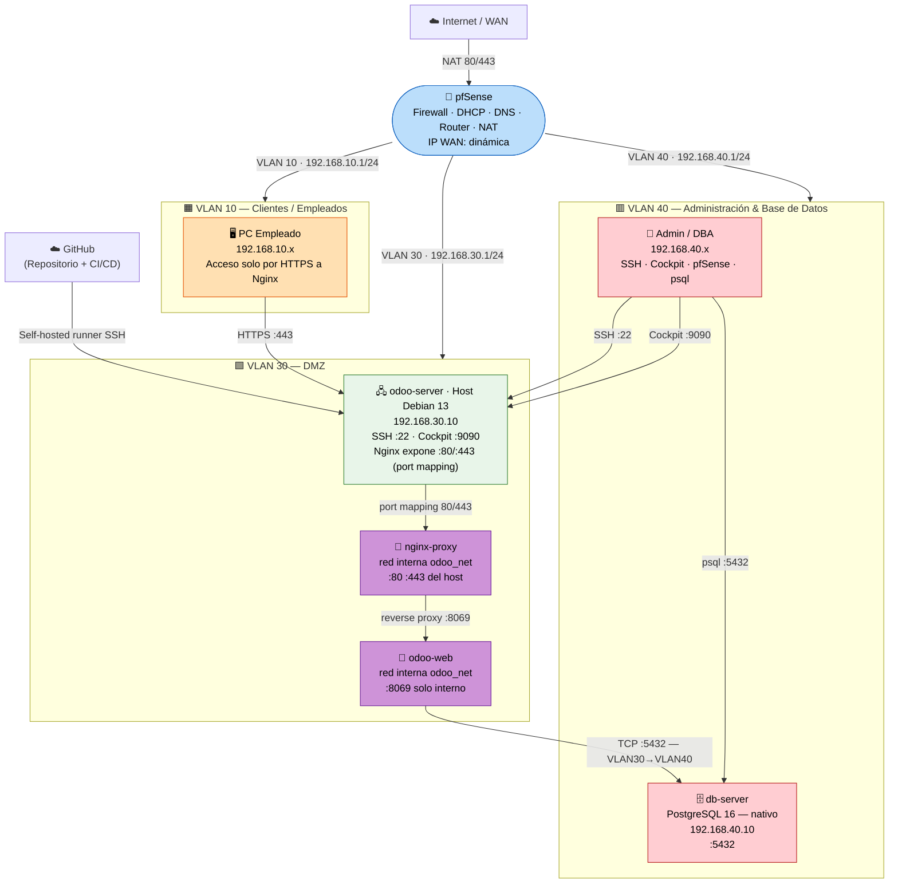

# Diagrama de Red — Arquitectura Completa

**ASIR 2025/2026 — TechSolutions S.L.**

> ⚠️ Este diagrama refleja la arquitectura **actual** (Junio 2026):
> PostgreSQL corre en una **VM externa** (`db-server`, `192.168.40.10`, VLAN 40).
> LDAP ha sido **descartado** del despliegue principal — ver `extras/ldap/`.
> **MACVLAN descartado**: VMware host-only (VMnet2/3) no permite promiscuous mode.

---

## Diagrama de Topología General



> **Cambio clave respecto a la arquitectura anterior:**
> `odoo_erp` (PostgreSQL) y `openldap` ya **no son contenedores Docker**.
> PostgreSQL está en la **VM independiente `db-server`** (`192.168.40.10`).
> LDAP fue descartado — disponible como referencia en `extras/ldap/`.

---

## Tabla de Direccionamiento IP Completa

| Componente | Zona | IP | Puerto(s) | Acceso desde |
|:-----------|:-----|:---|:---------|:-------------|
| pfSense — gateway VLAN 10 | VLAN 10 | `192.168.10.1` | 443 (panel) | Solo VLAN 40 |
| pfSense — gateway VLAN 30 (DMZ) | VLAN 30 | `192.168.30.1` | — | — |
| pfSense — gateway VLAN 40 (Admin/BD) | VLAN 40 | `192.168.40.1` | 443 (panel) | Solo VLAN 40 |
| **odoo-server · Host Debian 13** | DMZ (VLAN 30) | `192.168.30.10` | 22, 9090, **80, 443** | SSH/Cockpit: VLAN 40 / HTTPS: todos |
| └─ **nginx-proxy** (contenedor, port mapping) | DMZ (VLAN 30) | — (usa IP del host) | 80, 443 | Via host 192.168.30.10 |
| └─ **odoo-web** (contenedor, red interna) | DMZ (VLAN 30) | — (solo red `odoo_net`) | 8069, 8072 (interno) | Solo vía nginx-proxy |
| **db-server · PostgreSQL 16** | Admin/BD (VLAN 40) | `192.168.40.10` | 5432 | Solo VLAN 30 (Odoo) + VLAN 40 (admins) |
| Clientes empleados | VLAN 10 | `192.168.10.100–200` | — | DHCP |
| PCs administradores | VLAN 40 | `192.168.40.20–50` | — | DHCP |

> **LDAP eliminado:** No hay ninguna IP `192.168.30.22` ni servicio `:389/:636` activo en el despliegue principal.
> **MACVLAN eliminado:** Los contenedores NO tienen IPs propias en la red VLAN 30. Nginx expone los puertos 80/443 del host `192.168.30.10` vía Docker port mapping.

---

## Zonas de Seguridad y Políticas de Acceso

```
┌────────────────────────────────────────────────────────────────────────┐
│ INTERNET (WAN)                            │
│ Solo puertos 80/443 abiertos — NAT → 192.168.30.10 (host odoo)   │
└────────────────────────────────┬──────────────────────────────────────┘
                │
              [ pfSense ]
                │
     ┌─────────────────────┼──────────────────────┐
     │           │           │
  VLAN 10        VLAN 30 (DMZ)     VLAN 40
 (Clientes)       (Servidor)      (Admin + BD)
 192.168.10.0/24     192.168.30.0/24   192.168.40.0/24
     │           │           │
  PCs empleados    Debian 13 + Docker   Admins + DBAs
  Acceso Odoo     Nginx :80/:443     PostgreSQL VM
  solo HTTPS     (port mapping host)      │
     │          └──── :5432 ─────────────┘
     └─────── HTTPS :443 ──┤  (Odoo → PostgreSQL externo)
```

### Principio de anti-pivoting

| Origen | Destino | Estado |
|:-------|:--------|:------:|
| DMZ (VLAN 30) → VLAN 10 | Cualquier puerto | ❌ Bloqueado |
| DMZ (VLAN 30) → VLAN 40 | Cualquier puerto (excepto regla Odoo→PG) | ❌ Bloqueado |
| DMZ (VLAN 30) → pfSense gestión | Cualquier puerto | ❌ Bloqueado |
| VLAN 10 → VLAN 40 | Cualquier puerto | ❌ Bloqueado |
| VLAN 40 → VLAN 10 | Cualquier puerto | ❌ Bloqueado |
| VLAN 10 → BD (`192.168.40.10:5432`) | 5432 | ❌ Bloqueado |
| WAN → BD (`192.168.40.10`) | Cualquier puerto | ❌ Bloqueado |
| VLAN 30 (Odoo) → BD | 5432 | ✅ Permitido (regla explícita) |

---

## Flujo de Acceso de un Empleado

```
Empleado (VLAN 10) abre https://192.168.30.10 ← (o https://erp.odoo.com → DNS resuelve a 192.168.30.10)
     │
     ▼ pfSense: VLAN10 → DMZ :443 → PASS ✅
     │
   [ nginx-proxy — port mapping :443 en 192.168.30.10 ]
     │ Termina SSL/TLS
     │ proxy_pass → odoo-web:8069 (red interna odoo_net)
     │
   [ odoo-web — 172.19.0.x:8069 (red Docker interna) ]
     │ Autenticación interna de Odoo
     │ Consulta BD remota → 192.168.40.10:5432
     │
   [ db-server — 192.168.40.10:5432 ]
     │ PostgreSQL 16 nativo
     │ Responde consulta SQL
     │
   [ Odoo — Sesión iniciada ✅ ]
     │ Grupos y módulos según rol del usuario
     ▼
   Panel personalizado
```

---

## Red Docker Interna (odoo-server)

```
┌────────────────────────────────────────────────────────────┐
│ odoo-server (Debian 13) — 192.168.30.10               │
│                                   │
│ Puerto 80/443 del host ← Docker port mapping            │
│         │                          │
│ Red Docker: odoo_net (bridge — 172.19.0.0/16)            │
│                                   │
│ nginx-proxy (172.19.0.x) ────────► odoo-web (172.19.0.x)     │
│ [puerto 80/443 mapeado al host]     │             │
│                      ▼ TCP :5432        │
│               [ db-server — 192.168.40.10 ]      │
│                (FUERA de Docker, VLAN 40)      │
└────────────────────────────────────────────────────────────┘
```

> **MACVLAN descartado** (v1.9): VMware host-only (VMnet2/3) no permite promiscuous mode.
> Los contenedores acceden al exterior exclusivamente vía **Docker port mapping** al host `192.168.30.10`.

---

## Flujo de Backup Automático

```
Cron (cada 4h) en odoo-server
   │
   ▼ backup_postgres.sh
   │ pg_dump -h 192.168.40.10 -U odoo odoo_erp
   │ Comprime → odoo_YYYYMMDD_HHMM.sql.gz
   │ Guarda en /opt/odoo/backups/postgres/
   │ Retención: últimos 7 días
   ▼
/var/log/backup_odoo.log (rotado por logrotate)
```

---

*Referencia de reglas detalladas: [`docs/reglas_pfsense.md`](reglas_pfsense.md)*
*Guía de instalación: [`docs/INSTALACION_COMPLETA.md`](INSTALACION_COMPLETA.md)*
*Aprovisionamiento Vagrant: [`vagrant/README.md`](../vagrant/README.md)*
