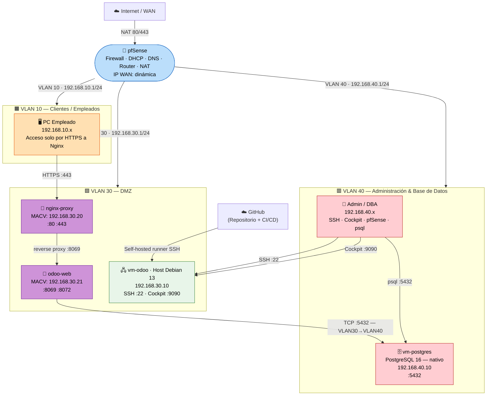

# Diagrama de Red — Arquitectura Completa

**TFG ASIR 2025/2026 — TechSolutions S.L.**

> ⚠️ Este diagrama refleja la arquitectura **actual** (Mayo 2026):
> PostgreSQL corre en una **VM externa** (`vm-postgres`, `192.168.40.10`, VLAN 40).
> LDAP ha sido **descartado** del despliegue principal — ver `extras/ldap/`.

---

## Diagrama de Topología General



> **Cambio clave respecto a la arquitectura anterior:**
> `odoo_erp` (PostgreSQL) y `openldap` ya **no son contenedores Docker**.
> PostgreSQL está en la **VM independiente `vm-postgres`** (`192.168.40.10`).
> LDAP fue descartado — disponible como referencia en `extras/ldap/`.

---

## Tabla de Direccionamiento IP Completa

| Componente | Zona | IP | Puerto(s) | Acceso desde |
|:-----------|:-----|:---|:---------|:-------------|
| pfSense — gateway VLAN 10 | VLAN 10 | `192.168.10.1` | 443 (panel) | Solo VLAN 40 |
| pfSense — gateway VLAN 30 (DMZ) | VLAN 30 | `192.168.30.1` | — | — |
| pfSense — gateway VLAN 40 (Admin/BD) | VLAN 40 | `192.168.40.1` | 443 (panel) | Solo VLAN 40 |
| **vm-odoo · Host Debian 13** | DMZ (VLAN 30) | `192.168.30.10` | 22, 9090 | Solo VLAN 40 |
| **nginx-proxy** (MACVLAN) | DMZ (VLAN 30) | `192.168.30.20` | 80, 443 | VLAN 10 + VLAN 40 + WAN |
| **odoo-web** (MACVLAN) | DMZ (VLAN 30) | `192.168.30.21` | 8069, 8072 (solo interno) | Solo vía Nginx |
| **vm-postgres · PostgreSQL 16** | Admin/BD (VLAN 40) | `192.168.40.10` | 5432 | Solo VLAN 30 (Odoo) + VLAN 40 (admins) |
| Clientes empleados | VLAN 10 | `192.168.10.100–200` | — | DHCP |
| PCs administradores | VLAN 40 | `192.168.40.20–50` | — | DHCP |

> **LDAP eliminado:** No hay ninguna IP `192.168.30.22` ni servicio `:389/:636` activo en el despliegue principal.

---

## Zonas de Seguridad y Políticas de Acceso

```
┌──────────────────────────────────────────────────────────────────────┐
│  INTERNET (WAN)                                                      │
│  Solo puertos 80/443 redirigidos por NAT al nginx-proxy (192.168.30.20) │
└───────────────────────────────┬──────────────────────────────────────┘
                                │
                           [ pfSense ]
                                │
         ┌──────────────────────┼──────────────────────┐
         │                      │                      │
    VLAN 10                VLAN 30 (DMZ)          VLAN 40
  (Clientes)              (Servidor)           (Admin + BD)
 192.168.10.0/24         192.168.30.0/24     192.168.40.0/24
         │                      │                      │
   PCs empleados       Debian 13 + Docker      Admins + DBAs
   Acceso Odoo         Nginx / Odoo            PostgreSQL VM
   solo HTTPS                 │                      │
         │                    └──── :5432 ────────────┘
         └─────── HTTPS :443 ──┘   (Odoo → PostgreSQL externo)
```

### Principio de anti-pivoting

| Origen | Destino | Estado |
|:-------|:--------|:------:|
| DMZ (VLAN 30) → VLAN 10 | Cualquier puerto | ❌ Bloqueado |
| DMZ (VLAN 30) → VLAN 40 | Cualquier puerto (excepto regla Odoo→PG) | ❌ Bloqueado |
| DMZ (VLAN 30) → pfSense gestión | Cualquier puerto | ❌ Bloqueado |
| VLAN 10 → VLAN 40 | Cualquier puerto | ❌ Bloqueado |
| VLAN 40 → VLAN 10 | Cualquier puerto | ❌ Bloqueado |
| VLAN 10 → BD (`192.168.40.10:5432`) | 5432 | ❌ Bloqueado |
| WAN → BD (`192.168.40.10`) | Cualquier puerto | ❌ Bloqueado |
| VLAN 30 (Odoo) → BD | 5432 | ✅ Permitido (regla explícita) |

---

## Flujo de Acceso de un Empleado

```
Empleado (VLAN 10) abre https://192.168.30.20
          │
          ▼  pfSense: VLAN10 → DMZ :443 → PASS ✅
          │
     [ nginx-proxy — 192.168.30.20:443 ]
          │  Termina SSL/TLS
          │  proxy_pass → odoo-web:8069
          │
     [ odoo-web — 192.168.30.21:8069 ]
          │  Autenticación interna de Odoo
          │  Consulta BD remota → 192.168.40.10:5432
          │
     [ vm-postgres — 192.168.40.10:5432 ]
          │  PostgreSQL 16 nativo
          │  Responde consulta SQL
          │
     [ Odoo — Sesión iniciada ✅ ]
          │  Grupos y módulos según rol del usuario
          ▼
     Panel personalizado
```

---

## Red Docker Interna (vm-odoo)

```
┌────────────────────────────────────────────────────────────┐
│  Red Docker: odoo_net (bridge — 172.19.0.0/16)             │
│                                                            │
│  nginx-proxy ──────────────► odoo-web                     │
│  (172.19.0.4)                (172.19.0.3)                  │
│  + macvlan 192.168.30.20     + macvlan 192.168.30.21       │
│                                │                           │
│                                ▼ TCP :5432                 │
│                       [ vm-postgres — 192.168.40.10 ]      │
│                         (FUERA de Docker, VLAN 40)         │
└────────────────────────────────────────────────────────────┘
```

> **Nota técnica MACVLAN:** Con el driver `macvlan`, el host Debian no puede comunicarse
> directamente con las IPs MACVLAN de sus propios contenedores.
> Para verificar desde el host: `docker run --rm --network macvlan_vlan30 alpine wget -qO- https://192.168.30.20`

---

## Flujo de Backup Automático

```
Cron (cada 4h) en vm-odoo
     │
     ▼ backup_postgres.sh
     │  pg_dump -h 192.168.40.10 -U odoo odooerp
     │  Comprime → odoo_YYYYMMDD_HHMM.sql.gz
     │  Guarda en /opt/odoo/backups/postgres/
     │  Retención: últimos 7 días
     ▼
/var/log/backup_odoo.log (rotado por logrotate)
```

---

*Referencia de reglas detalladas: [`docs/reglas_pfsense.md`](reglas_pfsense.md)*
*Guía de instalación: [`docs/INSTALACION_COMPLETA.md`](INSTALACION_COMPLETA.md)*
*Aprovisionamiento Vagrant: [`vagrant/README.md`](../vagrant/README.md)*
