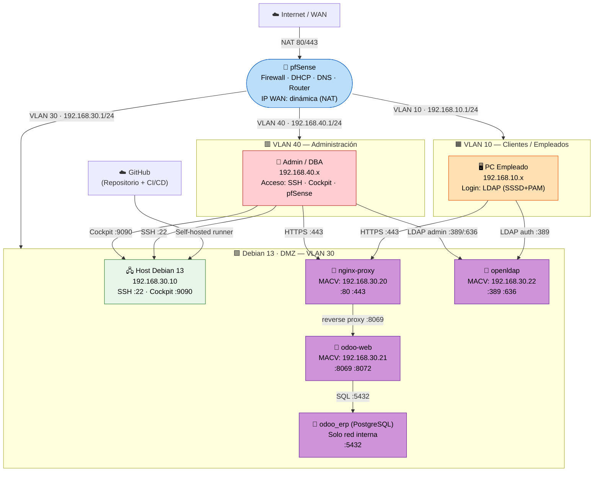

# Diagrama de Red — Arquitectura Completa

**TFG ASIR 2025/2026 — TechSolutions S.L.**

---

## Diagrama de Topología General



---

## Tabla de Direccionamiento IP Completa

| Componente | Zona | IP | Puerto(s) | Acceso desde |
|:-----------|:-----|:---|:---------|:-------------|
| pfSense — gateway LAN | VLAN 10 | `192.168.10.1` | 443 (panel) | Solo VLAN 40 |
| pfSense — gateway DMZ | VLAN 30 | `192.168.30.1` | — | — |
| pfSense — gateway Admin | VLAN 40 | `192.168.40.1` | 443 (panel) | Solo VLAN 40 |
| **Debian 13 host** | DMZ | `192.168.30.10` | 22, 9090 | Solo VLAN 40 |
| **nginx-proxy** (MACVLAN) | DMZ | `192.168.30.20` | 80, 443 | VLAN 10 + VLAN 40 + WAN |
| **odoo-web** (MACVLAN) | DMZ | `192.168.30.21` | 8069, 8072 (solo interno) | Solo via Nginx |
| **openldap** (MACVLAN) | DMZ | `192.168.30.22` | 389 (readonly), 636 (admin) | VLAN 10 (:389), VLAN 40 (:389/:636) |
| **odoo_erp** (PostgreSQL) | Red Docker | `172.19.0.x` | 5432 (solo interno) | Solo contenedor Odoo |
| Clientes empleados | VLAN 10 | `192.168.10.100–200` | — | DHCP |
| PCs administradores | VLAN 40 | `192.168.40.10–50` | — | DHCP |

---

## Zonas de Seguridad y Políticas de Acceso

```
┌─────────────────────────────────────────────────────────────────────┐
│  INTERNET (WAN)                                                     │
│  Solo puertos 80/443 redirigidos por NAT al nginx-proxy             │
└──────────────────────────────┬──────────────────────────────────────┘
                               │
                          [ pfSense ]
                               │
        ┌──────────────────────┼──────────────────────┐
        │                      │                      │
   VLAN 10                VLAN 30 (DMZ)          VLAN 40
 (Clientes)              (Servidor)           (Admin)
192.168.10.0/24         192.168.30.0/24     192.168.40.0/24
        │                      │                      │
  PCs empleados       Debian + Docker          Admins/DBAs
  Login LDAP          Nginx/Odoo/LDAP         SSH/Cockpit/pfSense
        │                      │
        └──── solo HTTPS ──────┘  (pfSense regla: VLAN10→DMZ :443 ✅)
        └──── PostgreSQL ──── ❌   (pfSense regla: VLAN10→DMZ :5432 ✗)
        └──── SSH/Cockpit ─── ❌   (pfSense regla: VLAN10→DMZ :22/:9090 ✗)
```

### Principio de anti-pivoting

| Origen | Destino | Estado |
|:-------|:--------|:------:|
| DMZ → VLAN 10 | Cualquier puerto | ❌ Bloqueado |
| DMZ → VLAN 40 | Cualquier puerto | ❌ Bloqueado |
| DMZ → pfSense LAN | Cualquier puerto | ❌ Bloqueado |
| VLAN 10 → VLAN 40 | Cualquier puerto | ❌ Bloqueado |
| VLAN 40 → VLAN 10 | Cualquier puerto | ❌ Bloqueado |

---

## Flujo de Autenticación de un Empleado

```
Empleado (VLAN 10) abre https://erp.odoo.tfg.com
         │
         ▼  DNS → pfSense DNS Resolver
         │  Host Override: erp.odoo.tfg.com → 192.168.30.10
         │
         ▼  pfSense: VLAN10→DMZ:443 → PASS ✅
         │
    [ nginx-proxy — 192.168.30.20:443 ]   ← CAPA C: filtra rutas por IP
         │  /web/database → 403 (VLAN 10 bloqueada)
         │  / → proxy_pass a odoo-web:8069
         │
    [ odoo-web — 192.168.30.21:8069 ]    ← CAPA B: tipo de usuario
         │  Login LDAP → consulta a cn=readonly
         │
    [ openldap — 192.168.30.22:389 ]
         │  uid=jdoe, password OK → ✅
         │
    [ Odoo — Sesión iniciada ]            ← CAPA A: grupos y módulos
         │  Tipo: Interno
         │  Grupos: ventas → CRM + Ventas + Facturas
         ▼
    Panel personalizado según rol ✅
```

---

## Red Docker Interna

```
┌──────────────────────────────────────────────────────┐
│  Red Docker: odoo_net (bridge — 172.19.0.0/16)       │
│                                                      │
│  nginx-proxy ──────► odoo-web ──────► odoo_erp       │
│  (172.19.0.4)        (172.19.0.3)    (172.19.0.2)   │
│  + macvlan .20       + macvlan .21   (sin MACVLAN)  │
│                                                      │
│  openldap                                            │
│  (172.19.0.5)                                        │
│  + macvlan .22                                       │
└──────────────────────────────────────────────────────┘
```

> [!NOTE]
> PostgreSQL (`odoo_erp`) no tiene IP MACVLAN intencionalmente: solo es accesible desde dentro de la
> red Docker interna. pfSense y los clientes de la LAN no pueden alcanzarlo directamente.

---

*Referencia de reglas detalladas: [`docs/reglas_pfsense.md`](reglas_pfsense.md)*
*Guía de instalación: [`docs/INSTALACION_COMPLETA.md`](INSTALACION_COMPLETA.md)*
