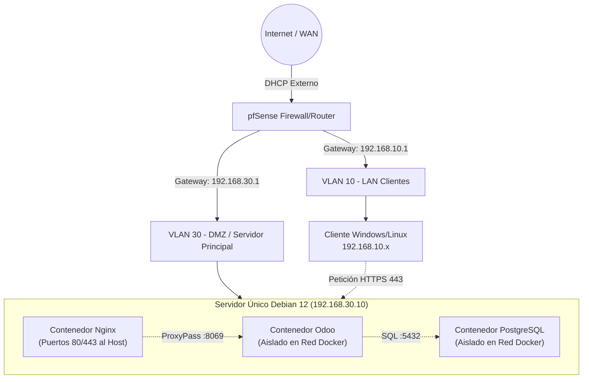

# Plan de Implantación Detallado: Odoo ERP con pfSense y Docker (TFG ASIR)

Este documento es la **hoja de ruta técnica principal** del proyecto. Contiene todos los pasos necesarios para desplegar el sistema ERP completo, con los comandos exactos a ejecutar, la justificación de cada decisión técnica y el orden correcto de ejecución. Sigue este plan de principio a fin para reproducir el entorno desde cero.

---

## Fase 0: Justificación Técnica e Investigación Previa

> ✅ **Completado:** Fase de investigación, comparativa de ERPs y diseño de arquitectura finalizada.
> Esta fase documenta las decisiones de diseño tomadas **antes de la implantación**, basadas en la investigación técnica previa. No requiere ejecución de comandos — es la base académica del proyecto.

### 0.1 Elección del ERP: Odoo vs Alternativas

Se evaluaron tres soluciones ERP de código abierto antes de elegir Odoo 17:

| Criterio | **Odoo 17** | Dolibarr | ERPNext |
| :--- | :--- | :--- | :--- |
| Facilidad de uso | ✅ Alta — interfaz moderna | Media — básico | Media — abrumador |
| Flexibilidad de API | ✅ XML-RPC + JSON-RPC maduro | Limitada | Alta pero compleja |
| Consumo de recursos | Moderado (VM decente) | ✅ Muy ligero | Pesado |
| Cobertura funcional | ✅ CRM, Ventas, RRHH, Inventario | Básico | Muy completo |
| Módulos de comunidad | ✅ Muy amplia | Moderada | Moderada |
| **Veredicto** | ✅ **Elegido** | Descartado | Descartado |

**Justificación**: Odoo 17 CE ofrece la mejor relación entre cobertura funcional, flexibilidad de integración y documentación oficial para un entorno académico ASIR.

### 0.2 Decisión de Sistema Operativo: Debian 12 vs Ubuntu/Mint

El informe de investigación menciona "Linux Mint 22 / base Ubuntu" como alternativa, pero el proyecto elige **Debian 12 (Bookworm)** por:
- **Estabilidad superior**: Debian tiene ciclos de soporte más largos que Ubuntu LTS
- **Estándar de producción**: La documentación de Odoo cita Debian como sistema de referencia
- **Sin snap ni paquetes propietarios**: El servidor queda limpio y predecible
- **Compatibilidad con Docker**: `docker.io` está disponible directamente en los repositorios oficiales de Debian

### 0.3 Nota Técnica: Redes Docker — Bridge vs Macvlan

La investigación menciona redes **macvlan** para exponer contenedores directamente a pfSense con IPs propias de la red física. Se evaluó su implementación:

**¿Qué es macvlan?**
Macvlan asigna a cada contenedor una dirección MAC e IP propias de la red física (VLAN 30, rango `192.168.30.x`). pfSense los vería como hosts físicos separados, no como un único servidor.

**¿Por qué se descarta en este TFG?**
- Requiere configuración adicional en el kernel del host Debian (`ip link add macvlan0 link eth0 type macvlan`)
- El contenedor host pierde comunicación con sus propios contenedores macvlan en algunos drivers
- Aumenta la complejidad de depuración sin aporte académico diferencial
- El modo **bridge** (tipo `bridge` en Docker Compose) es suficiente para la arquitectura DMZ con un único punto de entrada (Nginx en `192.168.30.10`)

**Documentado como mejora futura**: macvlan es la solución para entornos de producción real donde cada contenedor necesita su propia identidad de red ante el firewall.

### 0.4 Referencias Técnicas del Proyecto

| Área | Recurso | URL |
| :--- | :--- | :--- |
| Redes/pfSense | Configuración VLAN — Netgate | https://docs.netgate.com/pfsense/en/latest/vlan/configuration.html |
| Docker en DMZ | Macvlan Network en pfSense | https://vegard.blog.engen.priv.no/?p=364 |
| Hardening Linux | Linux Server Hardening Checklist 2026 | https://hostperl.com/blog/linux-server-hardening-checklist-essential-security-controls-production-2026 |
| Estándar CIS | CIS Linux Mint 22 Benchmark v1.0.0 | https://www.scribd.com/document/946643717/CIS-Linux-Mint-22-Benchmark-v1-0-0 |
| Odoo despliegue | Producción y Workers Multiproceso | https://www.odoo.com/documentation/19.0/administration/on_premise/deploy.html |
| Nginx para Odoo | Proxy Inverso y SSL | https://oec.sh/guides/odoo-nginx-config |
| PostgreSQL | Generic Audit Trigger (PL/pgSQL) | https://wiki.postgresql.org/wiki/Audit_trigger |
| Odoo Backup | Backup y Disaster Recovery | https://oec.sh/guides/odoo-backup-recovery |

---


## Arquitectura General del Sistema

### ¿Por qué esta arquitectura?

El diseño separa el sistema en tres capas de red diferenciadas (WAN → LAN → DMZ) gestionadas por pfSense. Esta segmentación garantiza que el servidor ERP en la DMZ nunca sea accesible directamente desde Internet sin pasar por el firewall, y que los equipos de la LAN tampoco puedan acceder al servidor sin reglas explícitas.

Dentro del servidor Debian, se usa Docker para aislar los tres procesos principales (base de datos, aplicación y proxy inverso) entre sí. Nginx es el único punto de entrada desde el exterior: el contenedor Odoo y el de PostgreSQL nunca exponen puertos al host, garantizando que no puedan ser atacados directamente.

### Diagrama de Conexiones Lógicas



### Tabla de Direccionamiento IP

| Zona | Subred (CIDR) | Gateway (pfSense) | IP del Sistema | Puertos expuestos | Servicio |
| :--- | :--- | :--- | :--- | :--- | :--- |
| **WAN** | Red DHCP del router físico | Router ISP | IP dinámica WAN | `80`, `443` (NAT) | Entrada desde Internet |
| **DMZ (VLAN 30)** | `192.168.30.0/24` | `192.168.30.1` | **`192.168.30.10`** | `22`, `80`, `443`, `9090` | Servidor Debian + Docker |
| **LAN Clientes (VLAN 10)** | `192.168.10.0/24` | `192.168.10.1` | `192.168.10.x` | — | Equipo cliente de usuario |
| *(Contenedor nginx)* | Red Docker interna | Switch Docker | Dinámica | `80`, `443` → host | Proxy Inverso |
| *(Contenedor odoo)* | Red Docker interna | Switch Docker | Dinámica | `8069` (cerrado) | Aplicación Odoo 17 |
| *(Contenedor db)* | Red Docker interna | Switch Docker | Dinámica | `5432` (cerrado) | PostgreSQL 16 |

---

## Fase 1: Preparación del Entorno de Red (pfSense)

> ✅ **Completado:** Máquinas virtuales creadas, interfaces asignadas y reglas de firewall/NAT configuradas y documentadas.

### ¿Por qué pfSense?

pfSense es un firewall de código abierto basado en FreeBSD que permite segmentar la red en zonas (WAN, LAN, DMZ), gestionar DHCP por zona, crear reglas de firewall por interfaz y hacer NAT/Port Forwarding. Es la solución estándar para simular un entorno empresarial real en un TFG.

### 1.1 Creación de Máquinas Virtuales

Crear en VirtualBox las siguientes VMs en este orden:

**VM 1 — pfSense (Firewall/Enrutador):**
- RAM: 1 GB | CPU: 1 core | Disco: 10 GB
- Adaptador 1: NAT o Bridged → será la interfaz **WAN** (salida a Internet)
- Adaptador 2: Red Interna `"LAN"` → será la interfaz **LAN Clientes (VLAN 10)**
- Adaptador 3: Red Interna `"DMZ"` → será la interfaz **DMZ (VLAN 30)**

**VM 2 — Debian 12 Server (Servidor ERP):**
- RAM: 4 GB | CPU: 2 cores | Disco: 40 GB
- Adaptador 1: Red Interna `"DMZ"` (misma que el Adaptador 3 de pfSense)
- IP estática a configurar: `192.168.30.10`

**VM 3 — Cliente Windows/Linux (Validación):**
- RAM: 2 GB | Adaptador 1: Red Interna `"LAN"`
- Obtendrá IP por DHCP de pfSense en el rango `192.168.10.x`

### 1.2 Configuración Inicial de pfSense

Arrancar la VM de pfSense e ir asignando las interfaces en el asistente de texto:
- `vtnet0` (Adaptador 1) → **WAN**
- `vtnet1` (Adaptador 2) → **LAN** (Gateway: `192.168.10.1`)
- `vtnet2` (Adaptador 3) → **DMZ** (Gateway: `192.168.30.1`)

Desde el interfaz web de pfSense (`https://192.168.10.1`), configurar:
- **DHCP en LAN (VLAN 10):** rango `192.168.10.100 – 192.168.10.200`
- **IP estática en DMZ:** asignar `192.168.30.1` a la interfaz OPT1/DMZ

### 1.3 Reglas de Firewall en pfSense

Las reglas se definen en **Firewall > Rules** por interfaz. El orden importa: pfSense evalúa de arriba a abajo y aplica la primera coincidencia.

**Interfaz WAN** (tráfico que llega desde Internet):
- Bloquear todo excepto los puertos `80` y `443` que serán redirigidos por NAT a la DMZ.

**Interfaz DMZ** (tráfico que sale del servidor Debian):
- Permitir: DNS saliente → `cualquier destino` en puerto `53/UDP`
- Permitir: HTTP/HTTPS saliente → `any` en puertos `80/TCP` y `443/TCP` (para que Debian pueda descargar paquetes y Docker pueda descargar imágenes)
- Bloquear: acceso desde DMZ hacia LAN Clientes (aislamiento de zonas)

**Interfaz LAN** (tráfico del equipo cliente):
- Permitir acceso desde LAN hacia la IP `192.168.30.10` en puertos `443`, `80` y `9090` (Cockpit)
- Permitir salida normal a Internet desde la LAN

**NAT / Port Forwarding** (Firewall > NAT > Port Forward):
- Interfaz: **WAN**
- Protocolo: TCP
- Destino: WAN address
- Puerto destino: `80` y `443`
- IP de redirección: `192.168.30.10`
- Puerto de redirección: `80` y `443`

---

## Fase 2: Configuración del Servidor Base (Debian 12)

> ✅ **Completado:** Preparación de sistema, Cockpit y dependencias de Docker cubiertas en el orquestador automático. Las validaciones de acceso están pendientes.

> **🚀 AUTOMATIZACIÓN (NUEVO EN FASE 9):**
> Aunque a continuación se detalla el proceso manual paso a paso por rigor académico, **todas las tareas de las Fases 2, 3 y 4 se han unificado en el script `install.sh`**.
> Para un despliegue rápido y real, sube el script al servidor o descárgalo y ejecuta:
> ```bash
> chmod +x install.sh
> sudo ./install.sh
> ```
> Este orquestador instalará dependencias, Docker, Cockpit, configurará el `.env` interactivo, levantará los contenedores y programará los backups automáticamente.

### ¿Por qué Debian 12 con entorno gráfico?

Se elige Debian 12 con GNOME porque la estabilidad de Debian es superior a Ubuntu Server para entornos de producción académica, y el entorno gráfico facilita la administración visual inicial y el acceso a Cockpit desde el propio servidor. Es una decisión pragmática para el TFG, donde la facilidad de demostración es importante.

### 2.1 Preparación Inicial del Sistema

Acceder al servidor Debian (por consola de VirtualBox o SSH desde el cliente):

```bash
# Verificar que la IP estática está bien asignada
ip addr show
# Debe mostrar 192.168.30.10 en la interfaz de red

# Comprobar conectividad a Internet a través del gateway pfSense
ping -c 4 8.8.8.8

# Actualizar el sistema completo antes de instalar nada
# Justificación: evita conflictos de dependencias con paquetes desactualizados
sudo apt update && sudo apt upgrade -y

# Instalar herramientas de administración esenciales
sudo apt install curl nano git bash-completion htop -y
```

### 2.2 Instalación de Cockpit (Panel Web de Gestión)

Cockpit permite administrar el servidor visualmente desde cualquier navegador sin necesidad de instalar software adicional en el cliente. Incluye terminal, monitor de recursos, gestión de servicios y, con plugins, gestión de contenedores Docker.

```bash
# Instalar Cockpit desde los repositorios oficiales de Debian
sudo apt install cockpit -y

# Activar el socket de Cockpit y habilitarlo en el arranque
# Usar el socket (no el servicio) es la práctica recomendada:
# Cockpit solo consume recursos cuando hay una sesión activa
sudo systemctl enable --now cockpit.socket

# Verificar que está escuchando correctamente
sudo systemctl status cockpit.socket
```

**Verificación:** Desde el equipo cliente (VLAN 10), abrir un navegador y acceder a `https://192.168.30.10:9090`. El navegador mostrará un aviso de certificado autofirmado (normal), aceptarlo y entrar con las credenciales del sistema operativo Debian.

```bash
# Instalar el plugin de métricas persistentes (historial de gráficas en Cockpit)
sudo apt install cockpit-pcp -y
sudo systemctl restart cockpit.socket
```

### 2.3 Instalación de Docker Engine y Docker Compose

Docker es el motor de contenedores que aísla cada servicio del ERP. Docker Compose orquesta los tres contenedores (db, odoo, nginx) como un stack unificado.

```bash
# Instalar Docker Engine y el CLI de Docker Compose
# Se usa docker.io (paquete oficial del repositorio Debian) para simplicidad en TFG
sudo apt install docker.io docker-compose -y

# Habilitar Docker para que arranque automáticamente con el sistema
sudo systemctl enable --now docker

# Añadir el usuario administrador al grupo docker
# Justificación: evita tener que usar "sudo" en cada comando docker,
# lo cual es necesario para que los scripts funcionen sin privilegios root
sudo usermod -aG docker $USER

# Aplicar el cambio de grupo sin cerrar sesión
newgrp docker

# Verificar la instalación
docker --version
docker compose version
docker ps   # Debe devolver una lista vacía (sin contenedores corriendo aún)
```

---

## Fase 3: Despliegue de la Infraestructura Docker (Odoo + PostgreSQL + Nginx)

> ✅ **Completado:** Estructura de volúmenes, red de contenedores, certificados y `docker-compose.yml` listos y unificados en la instalación automatizada.

### ¿Por qué estos tres contenedores?

- **PostgreSQL** (`db`): Motor de base de datos relacional. Odoo lo requiere obligatoriamente. Se aísla en la red Docker para que solo Odoo pueda acceder a él.
- **Odoo** (`odoo-web`): La aplicación ERP. No expone puertos al host, solo se comunica internamente.
- **Nginx** (`nginx-proxy`): Proxy inverso. Es el único punto de entrada desde el exterior. Gestiona SSL/TLS y redirige el tráfico al puerto interno `8069` de Odoo.

### 3.1 Preparar Estructura de Directorios en el Servidor

```bash
# Crear la estructura de carpetas del proyecto ERP
# Justificación de cada carpeta:
#   data/postgres   → Datos persistentes de PostgreSQL (sobrevive al borrado del contenedor)
#   data/odoo_addons → Módulos extra de Odoo (ampliaciones del ERP)
#   data/odoo_web   → Archivos subidos por usuarios, sesiones y caché de Odoo
#   data/odoo_etc   → Reservada para configuraciones adicionales
#   scripts/        → Scripts DevOps del proyecto (deploy, backup, monitor, etc.)
#   config_nginx/   → Configuración del servidor Nginx (proxy inverso)
#   certs/          → Certificados SSL autofirmados
mkdir -p /opt/erp-odoo/data/{postgres,odoo_addons,odoo_etc,odoo_web}
mkdir -p /opt/erp-odoo/{scripts,config_nginx,certs}
```

### 3.2 Copiar los Archivos del Repositorio al Servidor

Clonar el repositorio del proyecto directamente en el servidor:

```bash
# Clonar el repositorio en la carpeta del proyecto
cd /opt/erp-odoo
git clone https://github.com/sandrafrv/TFG-Implantacion_Segura_y_Automatizada_de_Odoo.git

# Verificar que los archivos están disponibles
ls -la docker/ scripts/ config_nginx/ sql/
```

O, si el repositorio ya está descargado en el PC de desarrollo, copiar los archivos por SCP:

```bash
# Desde el PC de desarrollo (Windows/Linux):
scp -r docker/ scripts/ config_nginx/ sql/ sandra@192.168.30.10:/opt/erp-odoo/
```

### 3.3 Generar los Certificados SSL Autofirmados

Los certificados SSL son necesarios para que Nginx pueda cifrar el tráfico HTTPS. En un TFG se usan autofirmados (no son válidos para producción real, pero son funcionales en entornos internos).

```bash
# Generar clave privada y certificado autofirmado con validez de 1 año
# -x509: genera directamente el certificado (sin CSR intermedio)
# -nodes: sin contraseña en la clave privada (necesario para que Nginx lo cargue automáticamente)
# -days 365: validez de 1 año
# -newkey rsa:2048: clave RSA de 2048 bits (estándar actual)
sudo openssl req -x509 -nodes -days 365 -newkey rsa:2048 \
    -keyout /opt/erp-odoo/certs/odoo-selfsigned.key \
    -out /opt/erp-odoo/certs/odoo-selfsigned.crt \
    -subj "/C=ES/ST=España/L=Local/O=TechSolutions/CN=erp.techsolutions.local"

# Verificar que se han generado correctamente
ls -la /opt/erp-odoo/certs/
```

### 3.4 Revisar y Ajustar el Archivo `.env`

El archivo `docker/.env` contiene las credenciales de la base de datos. **No debe subirse nunca a Git** (está en `.gitignore`). Ajustar los valores:

```bash
nano /opt/erp-odoo/docker/.env
```

Contenido recomendado:
```env
POSTGRES_DB=odoo_erp
POSTGRES_USER=odoo
POSTGRES_PASSWORD=<contraseña_segura_aqui>
```

### 3.5 Levantar el Stack con Docker Compose

El `docker-compose.yml` define los tres servicios (`db`, `odoo`, `nginx`) con sus volúmenes, variables de entorno y redes internas. Se ejecuta desde la raíz `/opt/erp-odoo`:

```bash
cd /opt/erp-odoo

# Arrancar todos los contenedores en segundo plano (detached)
docker compose -f docker/docker-compose.yml up -d

# Ver los logs en tiempo real para verificar que no hay errores
# (PostgreSQL debe arrancar primero, luego Odoo, luego Nginx)
docker compose -f docker/docker-compose.yml logs -f

# Verificar que los tres contenedores están en estado "Up"
docker compose -f docker/docker-compose.yml ps
```

**Verificación de salud desde el propio servidor:**
```bash
# Comprobar que Nginx responde en HTTPS (ignora error de certificado autofirmado con -k)
curl -I -k https://127.0.0.1
# Debe devolver: HTTP/2 302 o HTTP/1.1 200 OK (redirección al login de Odoo)
```

---

## Fase 4: Automatización y Scripts DevOps

> ✅ **Completado:** Scripts desarrollados, refactorizados, probados mediante CI estático y enlazados en cron. Validaciones finales manuales pendientes.

> **🚀 NOTA DE AUTOMATIZACIÓN:**
> Al igual que en las fases anteriores, si has ejecutado `install.sh`, **los permisos y las tareas cron ya están configurados automáticamente**. Los siguientes pasos solo explican el funcionamiento interno de estos scripts.

### ¿Por qué estos scripts?

El TFG exige demostrar buenas prácticas DevOps: despliegue automatizado, backups programados, monitorización activa y capacidad de recuperación ante fallos. Los scripts del directorio `/scripts` cubren cada uno de estos requisitos.

### 4.1 Dar Permisos de Ejecución a los Scripts

```bash
# Conceder permisos de ejecución a todos los scripts Bash
chmod +x /opt/erp-odoo/scripts/*.sh

# Verificar los permisos
ls -la /opt/erp-odoo/scripts/
```

### 4.2 Descripción y Justificación de Cada Script

| Script | Función | Cuándo usarlo |
|--------|---------|--------------|
| `deploy.sh` | Levanta el stack Docker con verificación de salud activa (espera hasta que Odoo responde en `/web/health`) | Primer despliegue o arranque manual |
| `update.sh` | Descarga nuevas versiones de las imágenes Docker y elimina imágenes huérfanas | Actualización del sistema ERP |
| `backup.sh` | Vuelca PostgreSQL con `pg_dump -F c` (formato comprimido con marca de tiempo) | Ejecución manual o por cron |
| `restore.sh` | Restauración limpia: elimina la BD actual, la recrea y restaura desde un backup | Recuperación ante fallos |
| `monitor.sh` | Verifica que los tres contenedores están activos; si alguno falla, lo reinicia y lo registra en `/var/log/erp_monitor.log` | Ejecución periódica por cron |
| `install_cron.sh` | Instala automáticamente todas las tareas cron del sistema de una sola vez | Configuración inicial del servidor |

### 4.3 Instalar las Tareas Cron Automáticamente

El script `install_cron.sh` programa las tres tareas automáticas sin necesidad de editar manualmente el crontab:

```bash
# Ejecutar el instalador de tareas cron
sudo /opt/erp-odoo/scripts/install_cron.sh

# Verificar que las tareas quedaron registradas
crontab -l
```

Las tareas que instala:
- **Monitor de salud** → cada 5 minutos (reinicia contenedores caídos automáticamente)
- **Backup diario** → todos los días a las 02:00 AM
- **Actualización semanal** → domingos a las 03:00 AM

### 4.4 Probar un Ciclo Completo de Backup y Restauración

```bash
# 1. Hacer un backup manual para comprobar que funciona
sudo /opt/erp-odoo/scripts/backup.sh
# Verificar que se creó el archivo .dump en la carpeta de backups
ls -lh /opt/erp-odoo/backups/

# 2. Probar la restauración (con el servicio odoo parado temporalmente)
docker compose -f /opt/erp-odoo/docker/docker-compose.yml stop odoo
sudo /opt/erp-odoo/scripts/restore.sh /opt/erp-odoo/backups/<archivo_mas_reciente>.dump
docker compose -f /opt/erp-odoo/docker/docker-compose.yml start odoo
```

---

## Fase 5: Auditoría Avanzada de Base de Datos (PL/pgSQL)

### ¿Por qué un trigger de auditoría?

El sistema de auditoría registra automáticamente en una tabla de log cada vez que se crea un nuevo usuario en Odoo. Esto demuestra conocimiento de PL/pgSQL y cumple con los requisitos de trazabilidad del TFG.

### 5.1 Conectarse a PostgreSQL dentro del Contenedor

```bash
# Acceder al intérprete de PostgreSQL dentro del contenedor odoo-db
docker exec -it odoo-db psql -U odoo -d odoo_erp
```

### 5.2 Ejecutar el Script de Auditoría

Una vez dentro de `psql`, ejecutar el contenido del archivo `sql/audit_triggers.sql`:

```bash
# Desde la terminal del servidor (fuera del contenedor)
docker exec -i odoo-db psql -U odoo -d odoo_erp < /opt/erp-odoo/sql/audit_triggers.sql
```

El script crea:
1. **Tabla `asir_audit_log`** → almacena cada evento auditado (tipo de acción, tabla afectada, ID del registro, timestamp)
2. **Función `func_audit_users()`** → lógica PL/pgSQL que inserta una fila en el log cuando se detecta un INSERT en `res_users`
3. **Trigger `trg_audit_new_odoo_user`** → enlaza la función a la tabla `res_users` de Odoo

### 5.3 Validar que la Auditoría Funciona

```bash
# Conectarse de nuevo a psql
docker exec -it odoo-db psql -U odoo -d odoo_erp

# Comprobar el contenido del log (después de crear un usuario desde la interfaz web de Odoo)
SELECT * FROM asir_audit_log ORDER BY action_time DESC LIMIT 10;
```

---

## Fase 6: Seguridad de Capa Host (UFW)

### ¿Por qué UFW además de pfSense?

pfSense protege el perímetro de red. UFW (Uncomplicated Firewall) protege el propio servidor Debian a nivel de host: si un atacante burla pfSense, UFW bloquea los puertos que no deberían estar accesibles. Es defensa en profundidad, una práctica de seguridad estándar.

```bash
# Instalar UFW si no está disponible
sudo apt install ufw -y

# Definir la política por defecto: bloquear todo el tráfico entrante
sudo ufw default deny incoming
sudo ufw default allow outgoing

# Permitir SSH para administración remota
sudo ufw allow 22/tcp

# Permitir Cockpit para el panel de gestión web
sudo ufw allow 9090/tcp

# Permitir tráfico HTTP y HTTPS al proxy Nginx
sudo ufw allow 80/tcp
sudo ufw allow 443/tcp

# Activar el firewall (pedirá confirmación)
sudo ufw enable

# Verificar el estado final
sudo ufw status verbose
```

---

## Fase 7: Validación Global del Sistema

### 7.1 Prueba de Acceso desde el Cliente (VLAN 10)

Desde el equipo cliente en la red LAN (`192.168.10.x`):

**Opción A — DNS local en pfSense:**
Ir a **Services > DNS Resolver** en pfSense y añadir un host override:
- Host: `erp`
- Domain: `techsolutions.local`
- IP: `192.168.30.10`

**Opción B — Archivo hosts en el cliente:**
```
# En Windows: C:\Windows\System32\drivers\etc\hosts
# En Linux:   /etc/hosts
192.168.30.10   erp.techsolutions.local
```

**Verificación final:**
1. Abrir navegador en el cliente → `https://erp.techsolutions.local`
2. Aceptar el aviso del certificado autofirmado
3. Debe aparecer la pantalla de login de Odoo 17
4. Iniciar sesión con las credenciales creadas durante la instalación de Odoo

### 7.2 Verificar los Triggers de Auditoría desde la Web

1. En Odoo → **Ajustes > Usuarios** → Crear un nuevo usuario
2. Volver al servidor y ejecutar:
```bash
docker exec -it odoo-db psql -U odoo -d odoo_erp -c "SELECT * FROM asir_audit_log ORDER BY action_time DESC;"
```
Debe aparecer una fila con `action_type = 'CREACION USUARIO'`.

---

## Fase 8: Pipeline CI/CD con GitHub Actions (Self-Hosted Runner)

### ¿Por qué un runner self-hosted?

Los runners gratuitos de GitHub (ubuntu-latest) no tienen acceso a la red privada de la DMZ. Registrar el propio servidor Debian como runner permite que GitHub Actions ejecute el despliegue automáticamente dentro de la red local cada vez que se hace un `git push` a `main`.

### 8.1 Obtener el Token de Registro en GitHub

1. Ir al repositorio en GitHub
2. **Settings → Actions → Runners → New self-hosted runner**
3. Seleccionar: `Linux` / `x64`
4. Copiar la URL del repositorio y el token que aparece (caduca en 1 hora)

### 8.2 Ejecutar el Script de Configuración del Runner

En el servidor Debian (`192.168.30.10`), como el usuario administrador (no root):

```bash
# Dar permisos y ejecutar el script de instalación del runner
chmod +x /opt/erp-odoo/scripts/setup_runner.sh
./opt/erp-odoo/scripts/setup_runner.sh
```

El script pedirá interactivamente:
1. La URL del repositorio (`https://github.com/<usuario>/TFG-ASIRB`)
2. El token de registro de GitHub (no se muestra en pantalla)

Después, automáticamente:
- Descarga el agente del runner de GitHub (detecta arquitectura x64/arm64)
- Registra el runner con el nombre `debian-dmz` y la etiqueta `self-hosted,debian-dmz,linux`
- Lo instala como servicio `systemd` para que arranque con el servidor

### 8.3 Verificar que el Runner está Activo

```bash
# Comprobar el estado del servicio del runner
cd ~/actions-runner
sudo ./svc.sh status
```

En GitHub: **Settings → Actions → Runners** → el runner `debian-dmz` debe aparecer como **Idle** (esperando jobs).

### 8.4 Activar el Pipeline Automático

```bash
# En el PC de desarrollo, hacer cualquier commit y push a main
git add .
git commit -m "feat: activar pipeline CD"
git push origin main
```

En la pestaña **Actions** del repositorio de GitHub:
- Aparecerá el workflow `CD Deploy` ejecutándose en el runner `debian-dmz`
- El runner ejecutará `scripts/deploy.sh` en el servidor
- Al finalizar, los contenedores estarán actualizados y funcionando

## Fase 9: Mejoras de Automatización Avanzada (Scripting y Docker)

### ¿Por qué estas mejoras?

Para acercar el despliegue a una experiencia de "enchufar servidor y olvidarse", se han añadido mejoras sobre la infraestructura base que simplifican el despliegue inicial, mejoran la configuración dinámica, robustecen los scripts existentes y aseguran el correcto seguimiento de los contenedores Docker mediante sus healthchecks nativos.

### 9.1 Novedades Implementadas

1. **Instalador `install.sh`**: Despliegue en 1 clic que clona el repo, instala dependencias, crea certificados y activa el cron.
2. **Plantilla de entorno `.env.example` y configurador `configure.sh`**: Script interactivo para configurar de forma segura las credenciales sin edición manual de archivos.
3. **Docker Healthchecks**: Se incorporó validación nativa (`pg_isready`, `curl`, `nginx -t`) en el `docker-compose.yml`.
4. **Logrotate**: Rotación semanal automática de los logs de sistema para evitar llenar la partición root.
5. **Orquestador `erp.sh`**: Comando único con subcomandos rápidos para el ciclo de vida (deploy, backup, logs, etc.).
6. **Pre-checks**: Comprobaciones de conectividad Docker, espacio libre y puertos libres antes de los despliegues.

> ✅ **Completado [2026-04-30]:** Todas las mejoras de scripting, plantillas de entorno y comprobaciones de healthcheck han sido implementadas exitosamente y añadidas al pipeline de CI (ShellCheck).

---

## Resumen de Ejecución y Orden de Arranque

---

## Fase 10: Documentación Final y Defensa

### ¿Por qué esta fase?
La última etapa del TFG consiste en asegurar que toda la implantación técnica se refleja correctamente en la memoria escrita y preparar el material necesario para la demostración práctica ante el tribunal.

### 10.1 Cierre de Documentación Técnica
- **Plan de Implantación**: Asegurar que este documento refleja la arquitectura final con sus automatizaciones.
- **Changelog**: Asegurar que `CHANGELOG.md` recoge todas las sesiones de trabajo.
- **Readme**: Consolidar el `README.md` como una guía rápida de despliegue ("Quickstart").

### 10.2 Preparación de la Memoria
Trasladar todo el trabajo técnico a la estructura formal requerida por el TFG:
- Introducción y Objetivos (basados en automatización y seguridad).
- Arquitectura (diagramas de red de pfSense y contenedores Docker).
- Implementación (detalles de bash scripts, nginx proxy, PostgreSQL audit).
- Pruebas de funcionamiento y Conclusiones.

### 10.3 Defensa y Demostración Práctica
Preparar un entorno real (o virtual) saneado y un guion para la demostración en vivo:
1. **Acceso inicial**: pfSense y reglas DMZ.
2. **Despliegue rápido**: Ejecutar `install.sh` y mostrar su automatización.
3. **Resiliencia**: Simular una caída (`docker stop odoo`) y mostrar cómo `monitor.sh` lo recupera automáticamente.
4. **Auditoría**: Demostrar el trigger PL/pgSQL mediante la creación de un usuario en Odoo y lectura del log.

---

## Resumen de Ejecución y Orden de Arranque

Una vez desplegado todo el sistema, el orden correcto de arranque ante un reinicio es:

1. **Encender la VM de pfSense** → esperar a que las interfaces de red estén activas
2. **Encender la VM de Debian** → Docker arranca automáticamente y levanta los tres contenedores
3. **Verificar desde el cliente** → abrir `https://erp.techsolutions.local` y comprobar acceso al ERP
4. **Acceder a Cockpit** → `https://192.168.30.10:9090` para monitorizar el estado del servidor

El sistema es autosuficiente: los contenedores Docker tienen `restart: always`, por lo que si el servidor se reinicia o un contenedor falla, se recuperan solos. El script `monitor.sh` ejecutado por cron cada 5 minutos proporciona una capa adicional de supervisión activa.
