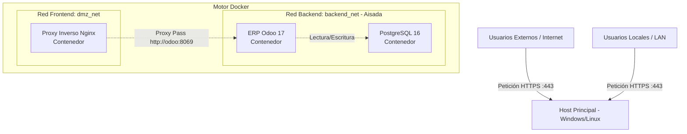

# Plan de Implantación Detallado: Odoo ERP con Docker 100% Contenerizado (TFG ASIR)

Este documento contiene el desglose técnico orientado a una arquitectura puramente basada en contenedores. Se prescinde de máquinas virtuales (VMs) y de hypervisores para apoyarse enteramente en **Docker y Docker Compose**. La segregación de red se logra mediante las redes virtuales (`bridge`) del propio motor de Docker.

---

## Fase 1: Arquitectura Lógica de Red en Docker

En esta arquitectura no dependemos de un pfSense externo ni de VLANs a nivel de capa de enlace. Todo se gestiona a través de la capa de red de Docker.

### 1.1 Esquema de Direccionamiento y Redes

**1. Diagrama de Conexiones Lógicas**



**2. Definición de Redes Virtuales (Docker Networks)**

*   **dmz_net:** Red tipo `bridge`. El contenedor Nginx expone sus puertos 80 y 443 al host directamente.
*   **backend_net:** Red tipo `bridge` marcada como `internal: true`. Sus contenedores (PostgreSQL y Odoo) no tienen puertos mapeados hacia afuera ni acceso directo. Solo Nginx puede comunicarse con Odoo a nivel de red interna.

---

## Fase 2: Preparación del Entorno (Directorio Host)

### 2.1 Requisitos Previos
1. Instalar **Docker Desktop** (si estás en Windows/macOS) o **Docker Engine + Docker Compose** nativo (en Linux).
2. Asegurar que los puertos `80` y `443` del ordenador host estén libres (sin otro Apache/IIS usando esos puertos).

### 2.2 Estructura del Proyecto
Abre tu terminal (PowerShell, CMD o Bash) en la raíz de tu proyecto y asegúrate de tener las siguientes carpetas:

```bash
mkdir -p ./data/{postgres,odoo_addons,odoo_etc,odoo_web}
mkdir -p ./scripts
mkdir -p ./sql
mkdir -p ./config_nginx
mkdir -p ./certs
```

---

## Fase 3: Orquestación Global (Docker Compose)

### 3.1 Creación del Fichero `docker-compose.yml`
En la raíz de la carpeta `docker`, crea el archivo `docker-compose.yml` e introduce todo el entorno orquestado de un solo golpe:

```yaml
version: '3.8'

services:
  # Base de Datos PostgreSQL
  db:
    image: postgres:16
    container_name: asir-postgres
    restart: always
    environment:
      - POSTGRES_DB=odoo_erp
      - POSTGRES_PASSWORD=SuperSecretAdminPassword123
      - POSTGRES_USER=odoo
      - PGDATA=/var/lib/postgresql/data/pgdata
    volumes:
      - ../data/postgres:/var/lib/postgresql/data/pgdata
    networks:
      - backend_net

  # Aplicativo ERP Odoo
  odoo:
    image: odoo:17
    container_name: asir-odoo
    restart: always
    depends_on:
      - db
    environment:
      - HOST=db
      - USER=odoo
      - PASSWORD=SuperSecretAdminPassword123
    volumes:
      - ../data/odoo_addons:/mnt/extra-addons
      - ../data/odoo_etc:/etc/odoo
      - ../data/odoo_web:/var/lib/odoo
    networks:
      - backend_net
      - dmz_net

  # Proxy Inverso en DMZ
  nginx:
    image: nginx:alpine
    container_name: asir-nginx
    restart: always
    ports:
      - "80:80"
      - "443:443"
    volumes:
      - ../config_nginx:/etc/nginx/conf.d
      - ../certs:/etc/ssl/certs
    depends_on:
      - odoo
    networks:
      - dmz_net

# Definición de las VLANs de Docker
networks:
  dmz_net:
    driver: bridge
  backend_net:
    driver: bridge
    internal: true # Bloquea el acceso entrante desde el exterior a la BBDD
```

---

## Fase 4: Configuración de Seguridad Perimetral (Nginx)

El proxy ahora corre en un contenedor de Alpine Linux.

### 4.1 Generar Certificados Locales (Host)
Genera o pega unos certificados `.key` y `.crt` autofirmados dentro de la carpeta `certs/`.
Si usas Git Bash o Linux WSL en tu Windows:
```bash
openssl req -x509 -nodes -days 365 -newkey rsa:2048 -keyout certs/odoo-selfsigned.key -out certs/odoo-selfsigned.crt
# Host común: localhost o erp.empresa.local
```

### 4.2 Configuración del `odoo_proxy.conf`
Crea el fichero de Nginx en tu carpeta host `config_nginx/odoo_proxy.conf`:

```nginx
server {
    listen 80;
    server_name localhost;
    return 301 https://$host$request_uri;
}

server {
    listen 443 ssl;
    server_name localhost;

    ssl_certificate /etc/ssl/certs/odoo-selfsigned.crt;
    ssl_certificate_key /etc/ssl/certs/odoo-selfsigned.key;
    
    ssl_protocols TLSv1.2 TLSv1.3;
    ssl_prefer_server_ciphers on;

    location / {
        # Al estar en red Docker, se usa el nombre del contenedor "odoo"
        proxy_pass http://odoo:8069;
        proxy_http_version 1.1;
        proxy_set_header Host $host;
        proxy_set_header X-Real-IP $remote_addr;
        proxy_set_header X-Forwarded-For $proxy_add_x_forwarded_for;
        proxy_set_header X-Forwarded-Proto $scheme;
    }
}
```

---

## Fase 5: Automatización y Mantenimiento (Scripts Bash)

Deberás ubicar estos ficheros dentro de `/scripts/`. Al ser todo bajo demanda contenedorizado, lanzaremos los scripts pasando las peticiones al socket Docker.

### 5.1 Script de Copia de Seguridad (`backup.sh`)
```bash
#!/bin/bash
BACKUP_DIR="../backups"
FECHA=$(date +"%Y%m%d_%H%M%S")
DB_CONT="asir-postgres"

mkdir -p $BACKUP_DIR
echo "Iniciando volcado..."
docker exec -t $DB_CONT pg_dump -U odoo -d odoo_erp -F c -f /tmp/backup_$FECHA.dump
docker cp $DB_CONT:/tmp/backup_$FECHA.dump $BACKUP_DIR/backup_$FECHA.dump
docker exec -t $DB_CONT rm /tmp/backup_$FECHA.dump
echo "Backup completado: backup_$FECHA.dump"
```

### 5.2 Tarea Cron / Tareas Programadas Windows
Si estás en Windows, asociar el script `.sh` al "Programador de Tareas" inyectándolo en WSL (`wsl.exe -e ./scripts/backup.sh`). Si ejecutas Docker desde un anfitrión Linux, se usa `crontab -e`.

---

## Fase 6: Auditoría en PostgreSQL (PL/pgSQL Trigger)

(Ocurre igual que en la planificación anterior; ejecutaremos la query directamente dentro del contenedor asir-postgres).

```sql
-- 1. Acceder: docker exec -it asir-postgres psql -U odoo -d odoo_erp
CREATE TABLE IF NOT EXISTS asir_audit_log (
    audit_id SERIAL PRIMARY KEY,
    action_type VARCHAR(50),
    table_name VARCHAR(50),
    record_id INT,
    action_time TIMESTAMP DEFAULT CURRENT_TIMESTAMP
);

CREATE OR REPLACE FUNCTION audit_users_action() RETURNS TRIGGER AS $$
BEGIN
    IF (TG_OP = 'INSERT') THEN
        INSERT INTO asir_audit_log (action_type, table_name, record_id)
        VALUES ('CREACION USUARIO', TG_TABLE_NAME, NEW.id);
        RETURN NEW;
    END IF;
    RETURN NULL;
END;
$$ LANGUAGE plpgsql;

CREATE TRIGGER tgr_audit_res_users AFTER INSERT ON res_users FOR EACH ROW EXECUTE FUNCTION audit_users_action();
```

---

## Fase 7: Despliegue y Pruebas
Una vez tengas los tres ficheros (`docker-compose.yml`, `odoo_proxy.conf` y los certificados), el arranque de toda tu plataforma TFG es un solo comando:

1. Abrir terminal en `TFG-ASIRB/docker`
2. Lanzar: `docker-compose up -d`
3. Entrar en `https://localhost` desde tu navegador.
4. El contenedor Nginx recibirá la petición de seguridad TLS y derivará los paquetes por la red `dmz_net` al contenedor `asir-odoo`, el cual comunicará sin salida a exterior con el `asir-postgres`. 
5. ¡Sistema 100% Contenerizado!
